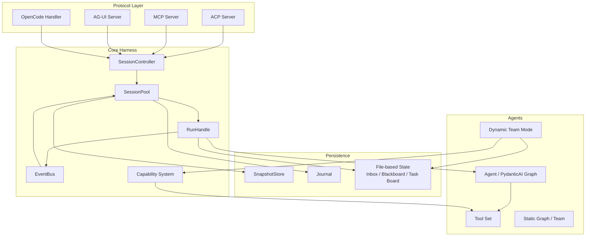

# 02: System Overview

This document provides a high-level view of AgentPool's architecture: the major
components, how they interact, and where Dynamic Team Mode fits in.

## High-level architecture

## Core components

### SessionController

The entry point for every protocol. It is responsible for:

- Receiving requests and mapping them to session/run operations.
- Creating, resuming, and closing sessions.
- Protocol-specific event translation.

It is intentionally thin. The heavy lifecycle logic lives in `SessionPool` and
`RunHandle`.

### SessionPool

Manages the collection of active sessions. It provides:

- `send_message`: deliver a message to a session.
- `run_agent`: start or resume a run.
- `revoke_message`: message lifecycle operations.

The V2 message ID infrastructure (RFC-0054) made these APIs public and stable,
which is the foundation for Dynamic Team Mode.

### RunHandle

A handle to a single agent run. It owns:

- The turn loop (`run`, `steer`, `followup`).
- The `AgentContext` passed to capabilities.
- Event emission and subscription.

Team Mode tools (e.g., `send_message`) are called from within the turn loop and
use the `RunHandle`'s delivery mechanisms.

### Capability System

A capability is a unit of functionality that can be injected into an agent. It
may add tools, modify the system prompt, or register event handlers. Examples
include `McpCapability`, `SubagentCapability`, and `TeamCommCapability`.

Dynamic Team Mode is implemented primarily as a new capability plus a small
configuration model. This is consistent with the Harness principle: add
primitives, not new architectural layers.

### EventBus

Internal pub/sub for events that cross component boundaries. It is used for:

- Session lifecycle events.
- Run progress events.
- Protocol notifications.

Team Mode may use the EventBus for internal coordination, but its external
interface to agents is tool-based (`send_message`, `task_create`, etc.).

### Persistence

Three persistence patterns are used:

| Pattern | Use case | Examples |
|---|---|---|
| SnapshotStore | Recoverable run state | M2 lifecycle dimensions |
| Journal | Audit and replay | Message history, run history |
| File-based state | LLM-readable shared state | Inbox, blackboard, task board |

Dynamic Team Mode deliberately uses file-based state for the inbox, blackboard,
and task board because files are inspectable, portable, and do not require a
database.

## Static vs. dynamic teams

AgentPool supports both modes, and they are not mutually exclusive.

| Aspect | Static (`graph:`, `teams:`) | Dynamic (`team_mode:`) |
|---|---|---|
| Composition time | Configuration time | Runtime, decided by LLM |
| Coordination | Program-defined | LLM-driven via tools |
| Communication | Implicit (graph edges) | Explicit (`send_message`) |
| Persistence | Run-scoped | Session-scoped, file-based |
| Use case | Known pipelines | Task-specific teams |

The static mechanisms compile to a pydantic-graph DAG. The dynamic mechanism
adds LLM-visible tools that create and manage persistent teammates.

## Dynamic Team Mode in the architecture

Dynamic Team Mode adds three pieces to the harness:

1. **`TeamModeConfig`** in YAML: declares which agents can be teammates, the
   protocol template, and optional `auto_init`.
2. **`TeamCommCapability`** (and related capabilities): injects team tools into
   the lead agent and team protocol into member agents.
3. **File-based state**: stores per-team inbox, blackboard, and task board in a
   configurable directory.

The key design decision is that the LLM, not the framework, decides when to
create a team, whom to include, and how to coordinate them. AgentPool provides
the primitives, constraints, and persistence.

## Data flow example: Lead creates a team

1. User sends a message to the lead agent.
2. Lead agent calls `team_create(name, members)`.
3. `TeamCommCapability` spawns member sessions via `SessionPool`.
4. Each member gets the team protocol injected into its system prompt.
5. Lead calls `send_message(to="member", body="...")`.
6. `TeamCommCapability` writes the message to the member's inbox file and uses
   `RunHandle.steer` or `SessionPool.send_message` to notify the member.
7. Member wakes up, reads its inbox, processes the message, and may respond.
8. Shared state lives in the blackboard and task board files.

## Boundaries and responsibilities

| Component | Owns | Does NOT own |
|---|---|---|
| `SessionController` | Protocol entry, session lifecycle | Business logic, team coordination |
| `SessionPool` | Session management, public send/run API | Agent internals, tool behavior |
| `RunHandle` | Turn loop, run context | Cross-session persistence |
| `Capability` | Tool injection, prompt augmentation | Protocol-specific message format |
| `EventBus` | Event routing | Long-term state |
| `File-based state` | Team inbox, blackboard, task board | General session storage |

## Open questions in the architecture

The following questions are intentionally not answered here. They are tracked in
[RFC-0055 design notes](../team-mode/RFC-0055-design-notes.md) and the [decision
records](./06-decisions/).

- Should team protocol be injected at spawn time or per turn?
- Should broadcast be sequential, concurrent, or event-based?
- How does multi-user `user_id` enter the team model?
- How do we cleanly close all member sessions when `team_delete` is called?
