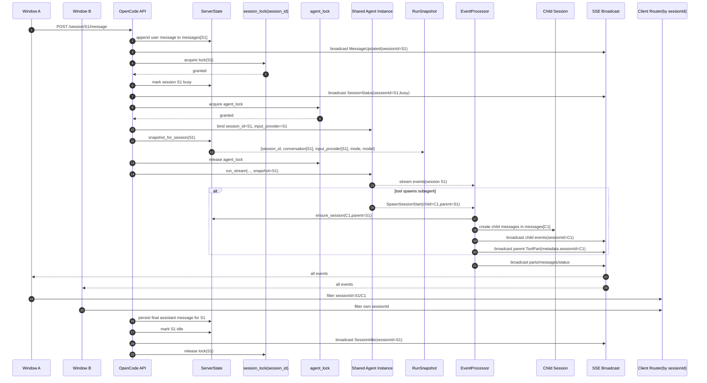
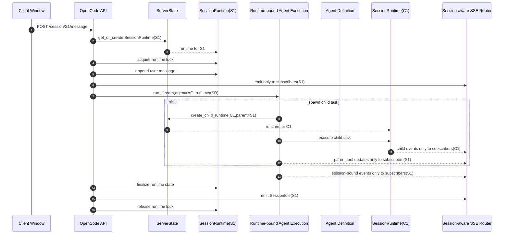

# 多窗口、多 Agent 与子 Agent 执行下的会话隔离分析

## 概述

本文分析当前 OpenCode + AgentPool 多 Agent、多窗口架构下，上下文是否会发生混乱，并说明当前的会话隔离、父子会话隔离以及运行时状态隔离是如何工作的。

这是一份**分析文档**，不是决策文档。对应的架构提案与迁移方案单独记录在：

- `docs/rfcs/draft/RFC-0023-session-runtime-hard-isolation.md`

---

## 执行摘要

当前系统更准确的描述是：**共享进程中的逻辑隔离执行模型**。

在大多数常规场景下，上下文通常不会混乱，因为实现中持续依赖以下机制：

- 以 `session_id` 作为主隔离键
- 以 `parent_id` / `parent_session_id` 表示父子链路
- 每个 session 独立的 turn 锁
- 每个 session 独立的 `MessageHistory`
- 每个 session 独立的 input provider
- 不可变的 `RunSnapshot`
- 面向子 agent 的事件包装与转发

但这种隔离还不是完全结构性的硬隔离。部分可变状态仍然位于 agent 实例级或进程级，因此系统正确性依赖于多个机制协同成立，而不是依赖一个天然的强所有权边界。

当前最大的未解决风险是：**同一个底层 agent 实例被多个 session 并发复用**。

---

## 分析范围

本文评估以下边界上的隔离情况：

1. 会话与会话之间的隔离
2. 多窗口之间的隔离
3. 主 agent 与子 agent 之间的隔离
4. agent 与 agent 之间的隔离
5. 后台 worker / task 的隔离
6. 传输层事件的隔离
7. 运行时状态的归属边界

---

## 当前隔离模型

## 1. 会话身份与持久化

当前的 session 模型是显式且可持久化的。

关键观察：

- `SessionData` 持有 `session_id`、`agent_name`、`pool_id`、`project_id`、`parent_id`、`cwd`、`agent_type` 以及 metadata。
- session store 以 `session_id` 为核心索引或查询条件，也可以附加 `pool_id`、`agent_name`、`parent_id` 等过滤条件。
- 子会话链路通过 `parent_id` 被显式持久化。

### 评估

这一层相对稳固。持久化模型本身看起来并不是上下文混乱的主要来源。这里的 session 是显式身份，而不是推导出来的隐式身份。

---

## 2. 服务端运行时隔离

OpenCode server 使用一个共享的 `ServerState`，但大多数可变状态桶都按 `session_id` 分区。

典型例子包括：

- `sessions[session_id]`
- `messages[session_id]`
- `todos[session_id]`
- `session_conversations[session_id]`
- `input_providers[session_id]`
- `session_locks[session_id]`
- `pending_async_prompts[session_id]`

### 评估

这意味着运行时是**共享的，但按 session 切分管理**。它不是每个窗口一个独立 server 对象，也不是每个 session 一个独立 server 实例。隔离是通过同一进程内的键控状态容器实现的。

这种方式在组织与路由上是有效的，但它仍然属于逻辑隔离，而不是独立进程级隔离。

---

## 3. 同一 Session 内的并发保护

同一个 session 的 turn 通过 `get_session_lock(session_id)` 串行化。

在 `message_routes.py` 中，服务端会：

1. 先创建 user message
2. 再把它追加到 `state.messages[session_id]`
3. 获取该 session 的独立锁
4. 在这把锁内完成剩余 turn 处理

### 评估

这是当前设计里最强的一层保护之一。

它能避免：

- 同一 session 内的消息交叉插入
- 同一 session 内 assistant 响应重叠
- 同一 session 的 queued / active 状态切换不一致

如果没有这把锁，同 session 上下文混乱的概率会高很多。

---

## 4. 基于 Snapshot 的单次运行隔离

在真正开始流式运行之前，服务端会捕获一个 `RunSnapshot`，其中包含当前 session 作用域下的运行时值，例如：

- `session_id`
- `conversation`
- `input_provider`
- model / mode 信息

随后运行过程会依赖这个 snapshot，而不是在执行过程中反复读取共享对象上的实时字段。

### 评估

这是当前防止运行中跨 session 污染的关键机制。

它降低了这样一种风险：某个 session 在一个上下文中启动运行，随后却在执行中意外读到了另一个 session 的实时 agent 状态。

不过，当前 snapshot 的捕获仍然发生在“共享 agent 临时重绑定到目标 session 之后”。这意味着 snapshot 本身具有保护作用，但其下层所有权模型依然建立在共享实例之上。

---

## 5. 父 / 子 Agent 隔离

子 agent 的执行使用的是显式 child session，而不是直接复用父 session。

当前行为是：

- 每次委派 task 或 worker run 时都会分配新的 `child_session_id`
- 子 session 通过 `parent_session_id` / `parent_id` 关联父 session
- 子消息写入 `messages[child_session_id]`
- 父 session 中只保留一个通过 metadata 指向 child session 的 tool part

### 评估

这是一个合理的设计。

它意味着：

- 父 session 仍然是协调面
- 子 session 仍然是执行面与转录面
- 父子默认不会共享同一份可变 conversation transcript

这是一种比较强的链路隔离形式。

---

## 6. 多窗口隔离

当前多窗口隔离依赖的是：**全局事件广播 + 按 session 感知的客户端路由**。

服务端行为：

- 所有 SSE subscribers 维护在一个全局集合中
- `broadcast_event()` 将事件广播给所有订阅者
- 事件本身携带 `sessionId`，或者服务端根据事件结构推导 `sessionId`

客户端行为：

- 每个窗口按 `sessionId` 对事件进行路由或过滤

### 评估

这属于**UI 层的逻辑隔离**，而不是传输层硬隔离。

该模型成立的前提是：

1. 所有 session 绑定事件都带有正确的 session 身份
2. 客户端过滤逻辑是正确的

因此，多窗口正确性是真实存在的，但它部分依赖客户端实现。

---

## 7. Agent 级运行时状态归属

这里是当前架构张力最明显的地方。

代码已经明确警告：同一个共享 agent 实例上的并发执行并不安全。如下字段仍然归属于 agent 实例本身：

- `_active_run_ctx`
- `_iteration_task`
- `conversation`
- `internal_fs`

### 评估

这是当前最大的残余风险区域。

当前设计通过以下机制组合，避免了很多实际错误：

- session lock
- agent lock
- snapshot capture
- session-scoped message history

但真正执行 run 的底层对象本身，仍然不是完全 session-native 的。

换句话说：

> 隔离模型说的是“每个 session 一份”，但一部分运行时所有权仍然在说“每个 agent 实例一份”。

这两者之间的不一致，就是当前最核心的未解决问题。

---

## 已经隔离得比较好的部分

下面这些部分目前相对稳固：

### Session 身份
- 显式 `session_id`
- 显式 `parent_id`
- 存储以 session 身份为键

### 同 Session 时序
- 每 session 独立 turn 锁
- 按 session 排空 queued async prompts

### 子 Session 链路
- child session 显式创建
- child messages 单独存储
- 父 session 通过 metadata 引用子 session，而不是共享 transcript

### 运行时事件标注
- 事件携带 `sessionId`
- 父子事件路径是显式的
- 子 agent 事件转发中存在 loop detection

---

## 仅做到逻辑隔离、尚未做到硬隔离的部分

### SSE 投递
- 先广播给所有订阅者
- 再由 `sessionId` 过滤

### Agent 运行时状态
- 共享 agent 实例仍然持有部分可变状态
- 当前正确性依赖“短暂绑定、快速 snapshot、之后尽量不读 live state”

### Worker 历史继承
- 某些 worker 路径仍会临时替换另一个运行时的 history，之后再恢复

### 临时文件系统状态
- `internal_fs` 是 agent-instance scoped，而不是严格的 session-runtime scoped

---

## 当前未解决的问题

## P0：共享 Agent 实例并发复用

### 问题

同一个 agent 实例仍可能被多个 session 复用，而部分运行时状态仍然归属于实例本身。

### 为什么重要

如果某条执行路径绕过了 snapshot discipline，或者削弱了它，这里就是最容易发生跨 session 污染的地方。

### 可能表现

- 中断到了错误的 run
- 活跃 iteration 跟踪被覆盖
- 读取到了错误的实时 conversation 状态
- session 本地的临时输出发生混用

---

## P0：Worker History 覆盖 / 恢复模式

### 问题

某些 worker 流程会临时把 worker 的 conversation/history 设置为父级 history，执行完后再恢复。

### 为什么重要

这是一种可变共享状态模式。在完全串行的流程中它可以工作，但相比 copy-based 或 runtime-bound 的继承方式，它更脆弱。

---

## P1：全局 SSE Fan-Out

### 问题

session 绑定事件目前仍然会被广播给所有 subscribers。

### 为什么重要

这会提高对客户端过滤的依赖，也使多窗口场景下的传输层隔离叙事更弱。

---

## P1：`internal_fs` 不是按 Session 持有

### 问题

临时输出与中间数据仍可能归属于 agent 实例，而不是归属于独立的 session runtime。

### 为什么重要

这会削弱后台任务、调试产物和工具输出的隔离保证。

---

## P2：Child Context 生命周期管理

### 问题

child event context 当前虽然能正确缓存和更新，但它的生命周期清理没有 session 身份模型那样明确。

### 为什么重要

这更像是完整性和可维护性问题，而不是立即会造成 session 混乱的问题，但长期可能累积出陈旧的 child runtime 状态。

---

## 风险分级汇总

| 优先级 | 问题 | 风险类型 | 摘要 |
|--------|------|----------|------|
| P0 | 共享 agent 实例复用 | 运行时正确性 | session 模型与 runtime ownership 之间最大的结构性错位 |
| P0 | worker history 覆盖/恢复 | 可变共享状态 | 正确性依赖严格的串行时序 |
| P1 | 全局 SSE fan-out | 传输层隔离 | UI 正确性依赖客户端路由/过滤 |
| P1 | agent-scoped `internal_fs` | 临时状态隔离 | 工具与任务输出并没有强 session 绑定 |
| P2 | child context 生命周期 | 状态卫生 | 更容易造成陈旧状态，而不是直接造成跨 session 污染 |

---

## 为什么系统今天通常仍然是可用的

尽管存在上述未解决问题，系统在大多数场景下仍然表现正确，因为有多层保护在同时生效：

1. session ID 是显式且稳定的
2. 同 session turn 被串行化
3. 存在每 session 独立 message history
4. 子 agent 执行会创建 child session，而不是直接复用父 session
5. 长时间运行依赖 `RunSnapshot`
6. 消息与 part 的持久化始终按 session 落盘

这套组合在常规流程里已经足够强。

当前的架构问题并不是“实现已经混乱”。真正的问题是：**最强的正确性保证依赖多个约定同时成立**。

---

## 建议方向

建议的长期方向是：

1. 引入显式 `SessionRuntime`
2. 将 conversation、active run context、iteration task、internal filesystem 等状态都迁入其中
3. 让 worker 和 subagent 通过 copy 或 runtime binding 继承上下文，而不是通过临时 mutation 继承
4. 将 SSE 投递从全局 fan-out 改为按 session 感知的服务端路由

这一路径的详细设计见：

- `docs/rfcs/draft/RFC-0023-session-runtime-hard-isolation.md`

---

## 当前状态时序图

---

## 目标状态时序图

---

## 结论

当前架构**并不是根本性混乱的**，但也**还没有达到完全硬隔离**。

当前实现里最强的部分是：

- 显式 session identity
- 每 session turn 串行化
- child session lineage
- 基于 snapshot 的运行中隔离

当前实现里最弱的部分是：

- 共享 agent 实例上的 runtime ownership
- 基于临时 mutation 的 worker 继承方式
- 全局 SSE fan-out
- agent-scoped 的临时文件系统状态

因此，更准确的结论是：

> 当前系统之所以大多数时候可靠，是因为多层逻辑隔离机制协同工作；而它剩余的架构性风险，主要集中在运行时状态仍由共享对象持有这一点上。
