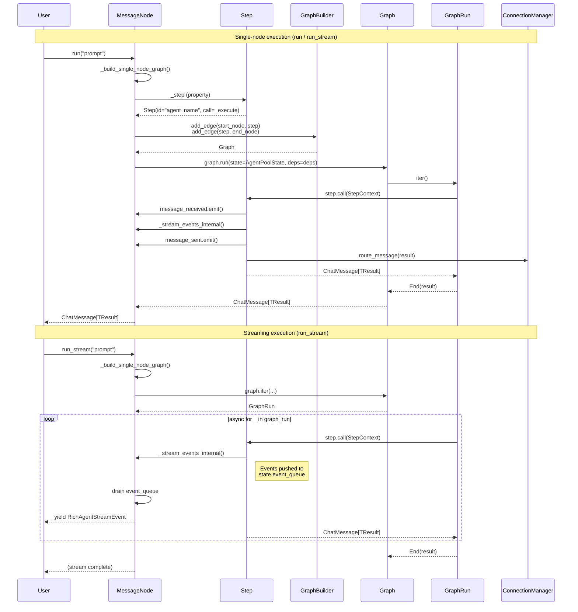

# MessageNode to pydantic-graph Step Adapter Design

**Status:** Design Draft  
**Date:** 2026-06-03  
**Scope:** Interface design only — no implementation  

---

## 1. Executive Summary

This document designs the adapter layer between AgentPool's `MessageNode` abstraction and pydantic-graph's `Step` / `Graph` execution model. The goal is to enable AgentPool to leverage pydantic-graph v2's execution engine (fork/join, step-by-step iteration, persistence) while preserving the existing `MessageNode` public API (`run()`, `run_stream()`, `run_message()`, `connect_to()`).

**Chosen Approach: Option A — MessageNode wraps a Step internally.**

A `MessageNode` retains its role as the user-facing unit of computation but internally delegates execution to a pydantic-graph `Step`. Node-level methods (`run_stream()`) drive a single-node graph via `Graph.iter()`. Connection-level methods (`connect_to()`) compile connected nodes into a pydantic-graph workflow.

---

## 2. Interface Analysis

### 2.1 AgentPool MessageNode (Current)

```python
class MessageNode[TDeps, TResult](ABC):
    # Signals
    message_received = Signal[ChatMessage[Any]]()
    message_sent = Signal[ChatMessage[Any]]()

    # Lifecycle
    async def __aenter__(self) -> Self: ...
    async def __aexit__(self, ...): ...

    # Execution
    @abstractmethod
    async def run(self, *prompts: Any, **kwargs: Any) -> ChatMessage[TResult]: ...

    async def run_message(self, message: ChatMessage[Any], **kwargs: Any) -> ChatMessage[TResult]: ...

    @abstractmethod
    def run_iter(self, *prompts: Any, **kwargs: Any) -> AsyncIterator[ChatMessage[Any]]: ...

    async def run_stream(self, *prompts: PromptCompatible, ...) -> AsyncIterator[RichAgentStreamEvent[TResult]]: ...

    # Connections
    def connect_to(self, target: MessageNode | ProcessorCallback | Sequence[...], ...) -> Talk | TeamTalk: ...
    def __rshift__(self, other): ...  # syntactic sugar for connect_to

    # Context & State
    def get_context(self, data: Any = None, ...) -> NodeContext: ...
    @property
    def storage(self) -> StorageManager | None: ...
```

Key characteristics:
- **Stateful instance**: Holds conversation history, tools, MCP servers, event managers
- **Signals**: `message_received` / `message_sent` for loose coupling
- **Streaming**: `run_stream()` yields `RichAgentStreamEvent` tokens
- **Connections**: Runtime wiring via `ConnectionManager` and `Talk`
- **Async context manager**: Requires `async with` for initialization

### 2.2 pydantic-graph BaseNode (Legacy v1)

```python
class BaseNode(ABC, Generic[StateT, DepsT, NodeRunEndT]):
    @abstractmethod
    async def run(self, ctx: GraphRunContext[StateT, DepsT]) -> BaseNode | End[NodeRunEndT]: ...

    @classmethod
    def get_node_id(cls) -> str: ...
```

Key characteristics:
- **Pure transition function**: Returns the *next* node to execute
- **No signals**: Events are implicit in the graph topology
- **No streaming**: `run()` is a single-shot async method
- **Stateless class-level logic**: Node identity is the class, not the instance

### 2.3 pydantic-graph Step / StepContext (v2)

```python
@dataclass(init=False)
class StepContext(Generic[StateT, DepsT, InputT]):
    _state: StateT
    _deps: DepsT
    _inputs: InputT

    @property
    def state(self) -> StateT: ...
    @property
    def deps(self) -> DepsT: ...
    @property
    def inputs(self) -> InputT: ...

class StepFunction(Protocol[StateT, DepsT, InputT, OutputT]):
    def __call__(self, ctx: StepContext[StateT, DepsT, InputT]) -> Awaitable[OutputT]: ...

@dataclass(init=False)
class Step(Generic[StateT, DepsT, InputT, OutputT]):
    id: NodeID
    _call: StepFunction[StateT, DepsT, InputT, OutputT]
    label: str | None

    def as_node(self, inputs: InputT | None = None) -> StepNode: ...
```

Key characteristics:
- **Function-centric**: A `Step` is a callable + metadata, not a stateful object
- **Typed context**: `StepContext` provides state, deps, and inputs
- **Composable**: Steps are wired together by a `GraphBuilder`, not by the steps themselves
- **Fork/Join**: `GraphBuilder` supports `Fork`, `Join`, `Decision`, and `Map` for parallel execution

### 2.4 pydantic-graph Graph / GraphRun (v2)

```python
@dataclass(init=False)
class Graph(Generic[StateT, DepsT, InputT, OutputT]):
    async def run(self, *, state: StateT = None, deps: DepsT = None, inputs: InputT = None) -> OutputT: ...

    @asynccontextmanager
    async def iter(self, *, state: StateT = None, deps: DepsT = None, inputs: InputT = None) -> AsyncIterator[GraphRun]: ...

class GraphRun(Generic[StateT, DepsT, OutputT]):
    async def next(self, value: EndMarker | Sequence[GraphTaskRequest] | None = None) -> EndMarker | Sequence[GraphTask]: ...
    @property
    def output(self) -> OutputT | None: ...
```

Key characteristics:
- **Immutable graph definition**: Built once via `GraphBuilder`, then executed
- **Step-by-step iteration**: `Graph.iter()` yields a `GraphRun` that can be driven manually
- **Task-based execution**: Internally uses `GraphTask` objects with fork stacks for parallelism
- **Error recovery**: `ErrorMarker` allows callers to intercept exceptions and redirect execution

---

## 3. Option Evaluation

### 3.1 Option A: MessageNode wraps a Step internally

**Design:** Each `MessageNode` owns an internal `Step` that encapsulates its core execution logic. `MessageNode.run()` constructs a single-node `Graph` and runs it. `MessageNode.run_stream()` uses `Graph.iter()` to drive execution step-by-step, yielding stream events from the internal state. `connect_to()` builds a pydantic-graph workflow from the connected topology.

```python
class MessageNode[TDeps, TResult](ABC):
    @property
    @abstractmethod
    def _step(self) -> Step[AgentPoolState, TDeps, ChatMessage[Any], ChatMessage[TResult]]: ...

    async def run(self, *prompts: Any, **kwargs: Any) -> ChatMessage[TResult]:
        graph = self._build_single_node_graph()
        state = AgentPoolState(node=self, prompts=prompts, kwargs=kwargs)
        result = await graph.run(state=state, deps=self._get_deps(), inputs=None)
        return result

    async def run_stream(self, *prompts: PromptCompatible, ...) -> AsyncIterator[RichAgentStreamEvent[TResult]]:
        graph = self._build_single_node_graph()
        state = AgentPoolState(node=self, prompts=prompts, kwargs=kwargs)
        async with graph.iter(state=state, deps=self._get_deps(), inputs=None) as graph_run:
            async for _ in graph_run:
                # Yield events captured from the node's internal event queue
                while event := self._event_queue.get_nowait():
                    yield event
```

**Pros:**
- Preserves 100% of the existing `MessageNode` public API
- `Step` is the v2 primitive — aligns with pydantic-graph's future direction
- `Graph.iter()` naturally maps to `run_stream()`'s step-by-step yielding
- Connection topology can be compiled to a `GraphBuilder` workflow
- Signals remain on `MessageNode` (user-facing); `Step` is purely execution logic

**Cons:**
- Slight overhead: single-node graph construction per `run()` call
- Requires an adapter layer to bridge `StepContext` to `AgentContext`
- Need to map `MessageNode` state (conversation, tools) to `Graph` state

**Verdict:** ✅ **Recommended**

---

### 3.2 Option B: MessageNode IS a BaseNode (survives v2)

**Design:** `MessageNode` inherits from `BaseNode` and implements `run(ctx: GraphRunContext) -> BaseNode | End`. This makes every agent/team a valid node in a pydantic-graph v1 graph. The existing `run()`, `run_stream()` etc. are preserved as convenience wrappers.

```python
class MessageNode[TDeps, TResult](BaseNode[AgentPoolState, TDeps, ChatMessage[TResult]], ABC):
    async def run(self, ctx: GraphRunContext[AgentPoolState, TDeps]) -> BaseNode | End[ChatMessage[TResult]]:
        # Execute the node, then return the next node (from connections) or End
        result = await self._execute(ctx.state.prompts)
        if next_node := self._resolve_next_node(result):
            return next_node
        return End(result)
```

**Pros:**
- Direct integration with pydantic-graph v1 (legacy `Graph.run()`)
- No wrapper overhead
- `BaseNode.get_node_id()` provides node identity for graph diagrams

**Cons:**
- `BaseNode` is the legacy v1 API; v2 is `Step`-centric
- `BaseNode.run()` returns the *next* node — this conflicts with `MessageNode.run()` returning the result
- `BaseNode` is stateless-at-class-level; `MessageNode` is stateful-per-instance. This impedance mismatch is severe: pydantic-graph v1 expects `MyNode()` (fresh instance) each time, but `MessageNode` holds conversation state.
- Does not leverage v2 `GraphBuilder` fork/join/decision capabilities
- Signals (`message_received`, `message_sent`) have no equivalent in `BaseNode`
- `run_stream()` cannot be expressed in `BaseNode` terms (no streaming in v1)

**Verdict:** ❌ Rejected — Legacy API mismatch, stateful/stateless impedance, no streaming

---

### 3.3 Option C: MessageNode becomes a factory that produces Step instances

**Design:** `MessageNode` is reconceptualized as a configuration factory. It no longer has `run()` directly; instead, it configures and returns a `Step` instance that is then wired into a `GraphBuilder` by the caller (e.g., `AgentPool`).

```python
class MessageNode[TDeps, TResult](ABC):
    @abstractmethod
    def build_step(self) -> Step[AgentPoolState, TDeps, ChatMessage[Any], ChatMessage[TResult]]: ...

    # run(), run_stream(), etc. are REMOVED from MessageNode
    # Execution happens only via Graph.run() / Graph.iter()
```

**Pros:**
- Cleanest alignment with pydantic-graph v2 architecture
- `Step` is the true unit of execution; `MessageNode` is purely declarative
- Forces all execution through the graph engine, enabling full optimization

**Cons:**
- **Breaking change**: Removes `agent.run("prompt")` — the primary public API
- Breaks `agent >> other_agent` connection syntax (no `run_message()` on the node)
- Breaks `async with Agent(...) as agent:` context manager pattern
- Signals would need to be attached to the `GraphRun` or `StepContext`, not the node
- Every existing user of AgentPool would need to rewrite their code
- The `MessageNode` abstraction loses its identity as an executable unit

**Verdict:** ❌ Rejected — Too disruptive; breaks the core "node as executable unit" abstraction

---

## 4. Chosen Approach: Option A (Detailed Design)

### 4.1 Core Philosophy

> `MessageNode` remains the **user-facing executable unit**. Internally, it delegates execution to a pydantic-graph `Step` and drives it via `Graph.iter()`. The `Step` is a private implementation detail; users continue to interact with `MessageNode` exactly as before.

### 4.2 Type Signatures

#### AgentPoolState — Graph State

```python
from dataclasses import dataclass, field
from typing import Any

from agentpool.messaging import ChatMessage


@dataclass
class AgentPoolState:
    """Shared state passed through the pydantic-graph execution.

    Holds the input prompts, node reference, and a conduit for
    streaming events back to the caller.
    """

    node: MessageNode[Any, Any]
    """The MessageNode being executed."""

    prompts: tuple[Any, ...]
    """Input prompts for this execution."""

    kwargs: dict[str, Any] = field(default_factory=dict)
    """Additional keyword arguments passed to run()."""

    # Streaming conduit
    event_queue: asyncio.Queue[RichAgentStreamEvent[Any]] = field(
        default_factory=asyncio.Queue
    )
    """Queue for streaming events from the Step back to run_stream()."""

    # Result capture
    result: ChatMessage[Any] | None = None
    """Final result populated by the Step upon completion."""
```

#### MessageNode._step property

```python
class MessageNode[TDeps, TResult](ABC):
    @property
    @abstractmethod
    def _step(self) -> Step[AgentPoolState, TDeps, ChatMessage[Any], ChatMessage[TResult]]:
        """Return the pydantic-graph Step representing this node's execution logic.

        The Step's call function receives a StepContext with:
        - state: AgentPoolState (prompts, event queue, node reference)
        - deps: TDeps (node dependencies, e.g., database connections)
        - inputs: ChatMessage[Any] (the input message, or None for root runs)

        The Step is responsible for:
        1. Emitting streaming events to state.event_queue
        2. Returning the final ChatMessage[TResult]
        3. Routing the result to connected nodes via state.node.connections

        Returns:
            A Step configured with this node's execution logic.
        """
        ...
```

#### BaseAgent._step implementation (example)

```python
class BaseAgent[TDeps = None, TResult = str](MessageNode[TDeps, TResult]):
    @property
    def _step(self) -> Step[AgentPoolState, TDeps, ChatMessage[Any], ChatMessage[TResult]]:
        async def _execute(ctx: StepContext[AgentPoolState, TDeps, ChatMessage[Any]]) -> ChatMessage[TResult]:
            state = ctx.state
            node = state.node
            assert isinstance(node, BaseAgent)

            # Reconstruct the run_stream() logic inside the Step
            # 1. Emit message_received signal
            user_msg = ChatMessage.user_prompt(message=state.prompts)
            await node.message_received.emit(user_msg)

            # 2. Stream events via the event queue
            async for event in node._stream_events_internal(
                prompts=state.prompts,
                user_msg=user_msg,
                deps=ctx.deps,
            ):
                await state.event_queue.put(event)

            # 3. Capture final result
            final_message = node._last_result  # set by _stream_events_internal
            state.result = final_message

            # 4. Emit message_sent signal
            await node.message_sent.emit(final_message)

            # 5. Route to connected nodes
            await node.connections.route_message(final_message)

            return final_message

        return Step(
            id=NodeID(self.name),
            call=_execute,
            label=self.description or self.name,
        )
```

#### Single-node Graph builder

```python
class MessageNode[TDeps, TResult](ABC):
    def _build_single_node_graph(self) -> Graph[AgentPoolState, TDeps, ChatMessage[Any], ChatMessage[TResult]]:
        """Build a graph containing only this node's Step.

        The graph has:
        - start_node -> this node's Step -> end_node
        """
        builder = GraphBuilder[
            AgentPoolState, TDeps, ChatMessage[Any], ChatMessage[TResult]
        ](name=f"single_{self.name}")

        step = self._step
        builder.add_edge(builder.start_node, step)
        builder.add_edge(step, builder.end_node)

        return builder.build()
```

#### run() implementation

```python
class MessageNode[TDeps, TResult](ABC):
    async def run(self, *prompts: Any, **kwargs: Any) -> ChatMessage[TResult]:
        """Execute node with prompts via pydantic-graph.

        Constructs a single-node graph and runs it to completion.
        """
        graph = self._build_single_node_graph()
        state = AgentPoolState(node=self, prompts=prompts, kwargs=kwargs)
        deps = self._get_deps()

        return await graph.run(state=state, deps=deps, inputs=None)
```

#### run_stream() implementation

```python
class MessageNode[TDeps, TResult](ABC):
    async def run_stream(
        self,
        *prompts: PromptCompatible,
        store_history: bool = True,
        message_id: str | None = None,
        session_id: str | None = None,
        parent_session_id: str | None = None,
        parent_id: str | None = None,
        message_history: MessageHistory | None = None,
        input_provider: InputProvider | None = None,
        wait_for_connections: bool | None = None,
        deps: TDeps | None = None,
        event_handlers: Sequence[AnyEventHandlerType] | None = None,
        depth: int = 0,
    ) -> AsyncIterator[RichAgentStreamEvent[TResult]]:
        """Run agent with streaming output via pydantic-graph Graph.iter().

        Uses Graph.iter() to drive execution step-by-step, yielding
        RichAgentStreamEvent tokens from the node's internal event queue.
        """
        graph = self._build_single_node_graph()
        state = AgentPoolState(
            node=self,
            prompts=prompts,
            kwargs={
                "store_history": store_history,
                "message_id": message_id,
                "session_id": session_id,
                "parent_session_id": parent_session_id,
                "parent_id": parent_id,
                "message_history": message_history,
                "input_provider": input_provider,
                "wait_for_connections": wait_for_connections,
                "deps": deps,
                "event_handlers": event_handlers,
                "depth": depth,
            },
        )

        async with graph.iter(state=state, deps=deps, inputs=None) as graph_run:
            async for _task in graph_run:
                # Drain the event queue after each graph step
                while not state.event_queue.empty():
                    try:
                        event = state.event_queue.get_nowait()
                        yield event
                    except asyncio.QueueEmpty:
                        break

        # Yield any remaining events after graph completion
        while not state.event_queue.empty():
            try:
                event = state.event_queue.get_nowait()
                yield event
            except asyncio.QueueEmpty:
                break
```

### 4.3 Lifecycle Diagram



### 4.4 Signal Mapping

AgentPool `MessageNode` signals must be bridged to pydantic-graph `GraphRun` events.

| AgentPool Signal | pydantic-graph Equivalent | Mapping Strategy |
|---|---|---|
| `message_received` | None (explicit in `StepContext.inputs`) | Emitted by the `Step` at the start of execution. The input message is already in `ctx.inputs`, but the signal is preserved for backward compatibility and for listeners outside the graph. |
| `message_sent` | `GraphRun` completion (EndMarker) | Emitted by the `Step` after the result is produced. In `Graph.iter()` terms, this fires when the step yields its output and the graph transitions toward `End`. |
| `run_failed` | `ErrorMarker` | When the `Step` raises an exception, pydantic-graph v2 yields an `ErrorMarker`. The adapter catches this and emits `run_failed` before re-raising or allowing recovery. |
| `agent_reset` | Graph state reset | `AgentReset` is a node-level lifecycle event, not tied to graph execution. It remains on `MessageNode` and is not mapped to graph events. |
| `state_updated` | None | Model/state changes are node-level concerns. Preserved as-is. |
| `interrupted` | `CancelScope` cancellation | When a node is interrupted, the adapter cancels the `GraphRun`'s `CancelScope`, which propagates to all active tasks in the fork. |

#### Detailed Signal Mapping

```python
# message_received -> Step start
async def _execute(ctx: StepContext[AgentPoolState, TDeps, ChatMessage[Any]]) -> ChatMessage[TResult]:
    state = ctx.state
    node = state.node

    # Reconstruct the input message from prompts
    user_msg = ChatMessage.user_prompt(message=state.prompts)

    # Emit the signal (preserved for backward compatibility)
    await node.message_received.emit(user_msg)

    # ... execute ...

# message_sent -> Step completion (before returning)
    final_message = await _execute_core(...)
    await node.message_sent.emit(final_message)
    return final_message

# run_failed -> ErrorMarker recovery
# In run_stream(), when Graph.iter() yields an ErrorMarker:
async for marker in graph_run:
    if isinstance(marker, ErrorMarker):
        failed_event = BaseAgent.RunFailedEvent(
            agent_name=self.name,
            message="Agent stream failed",
            exception=marker.error,
        )
        await self.run_failed.emit(failed_event)
        # Allow pydantic-graph's error recovery or re-raise
        raise marker.error
```

### 4.5 run_stream() to Graph.iter() Mapping

`run_stream()` is the most complex mapping because it must yield `RichAgentStreamEvent` tokens during execution, not just at the end.

| AgentPool Concept | pydantic-graph Concept | Notes |
|---|---|---|
| `run_stream()` | `Graph.iter()` + manual driving | `Graph.iter()` yields a `GraphRun`. Async-iterating over `GraphRun` drives execution step-by-step. |
| `RichAgentStreamEvent` yield | `state.event_queue` drain | The `Step` pushes events to `AgentPoolState.event_queue`. `run_stream()` drains this queue after each graph step. |
| Session management | `GraphRun` state | `session_id`, `parent_session_id` are stored in `AgentPoolState.kwargs` and handled by the Step. |
| Prompt queuing (`queue_prompt`) | `GraphRun.override_next()` | When a tool calls `queue_prompt()`, the adapter calls `graph_run.override_next()` to inject a new task with the queued prompts. |
| Injection manager | `GraphRun.next(value)` | `inject_prompt()` can be mapped to sending a new `GraphTaskRequest` to `graph_run.next()`. |
| Tool execution events | Step internal streaming | Tool start/complete events are emitted by the `Step` during `_stream_events_internal()` and captured in the event queue. |
| Connection routing | Step post-processing | After the `Step` returns, it calls `node.connections.route_message(result)` before returning to the graph. |

```python
# run_stream() mapped to Graph.iter() — detailed flow
async def run_stream(self, *prompts, **kwargs) -> AsyncIterator[RichAgentStreamEvent[TResult]]:
    graph = self._build_single_node_graph()
    state = AgentPoolState(node=self, prompts=prompts, kwargs=kwargs)

    async with graph.iter(state=state, deps=kwargs.get("deps"), inputs=None) as graph_run:
        # Drive the graph step by step
        while True:
            try:
                marker = await graph_run.next()
            except StopAsyncIteration:
                break

            if isinstance(marker, ErrorMarker):
                # Map to run_failed signal, then re-raise
                await self.run_failed.emit(...)
                raise marker.error

            # After each step, drain the event queue
            while not state.event_queue.empty():
                event = await asyncio.wait_for(state.event_queue.get(), timeout=0.01)
                yield event

    # Drain any final events
    while not state.event_queue.empty():
        yield state.event_queue.get_nowait()
```

### 4.6 connect_to() Handling

`connect_to()` creates runtime connections between `MessageNode`s via `ConnectionManager` and `Talk`. In pydantic-graph terms, this is graph topology.

#### Strategy: Compile connections to GraphBuilder edges

When `AgentPool` loads agents and their connections from YAML, it can compile the connection topology into a `GraphBuilder` workflow:

```python
class AgentPool:
    def _compile_connections_to_graph(self) -> Graph[AgentPoolState, Any, Any, Any] | None:
        """Compile all MessageNode connections into a pydantic-graph workflow.

        This is an optional optimization: if connections form a DAG,
        they can be executed via pydantic-graph's fork/join engine
        instead of AgentPool's ConnectionManager.
        """
        from pydantic_graph.graph_builder import GraphBuilder

        builder = GraphBuilder[AgentPoolState, Any, Any, Any](name="agent_pool_workflow")

        # Add all agent steps as nodes
        for name, node in self._registry.items():
            builder.add(node._step)

        # Add edges from connections
        for name, node in self._registry.items():
            for talk in node.connections.get_connections():
                for target in talk.targets:
                    builder.add_edge(
                        node._step,
                        target._step,
                        label=talk.connection_type,
                    )

        return builder.build()
```

#### Runtime ConnectionManager (preserved)

Not all connections can be statically compiled (e.g., dynamic `connect_to()` calls, conditional filters). For these, the existing `ConnectionManager` + `Talk` system remains:

```python
class MessageNode:
    async def run(self, *prompts, **kwargs) -> ChatMessage[TResult]:
        result = await self._run_via_graph(prompts, kwargs)

        # After graph execution, route to connected nodes
        # This preserves the existing ConnectionManager behavior
        await self.connections.route_message(result)
        return result
```

#### Hybrid approach

- **Static connections** (from YAML config): Compiled to `GraphBuilder` edges when the pool starts
- **Dynamic connections** (runtime `connect_to()`): Handled by `ConnectionManager` as before
- **Fork/Join teams**: A parallel `Team` can be expressed as a `Fork` + `Join` in `GraphBuilder`
- **Sequential teams**: A `TeamRun` (chain) is a simple sequence of edges

```python
# Team parallel -> Fork + Join
team = agent1 & agent2 & agent3
# Compiled to:
# fork -> [agent1, agent2, agent3] -> join -> result

# Team sequential -> Edge chain
team = agent1 | agent2 | agent3
# Compiled to:
# agent1 -> agent2 -> agent3 -> end
```

---

## 5. Migration Path

### Phase 1: Internal Step wrapper (no public API change)

1. Add `_step` abstract property to `MessageNode`
2. Implement `_step` in `BaseAgent` (default implementation delegates to existing `_stream_events`)
3. Add `_build_single_node_graph()` to `MessageNode`
4. Update `run()` and `run_stream()` to use `Graph.run()` / `Graph.iter()` internally
5. All existing tests pass without modification

### Phase 2: Graph-based team execution

1. Teach `AgentPool` to compile static connections to `GraphBuilder`
2. Implement `Team` as `Fork` + `Join`
3. Implement `TeamRun` as edge chain
4. Add opt-in flag: `use_graph_engine: true` in YAML config

### Phase 3: Full pydantic-graph integration

1. Deprecate `ConnectionManager` runtime routing for static topologies
2. Use pydantic-graph persistence for state snapshots
3. Leverage `GraphRun.next()` for interactive debugging
4. Generate mermaid diagrams from compiled graphs

---

## 6. Open Questions

1. **ContextVar isolation**: `_current_run_ctx_var` is a `ContextVar`. Does pydantic-graph's task-group execution preserve ContextVar values across `Fork` branches?
2. **Signal emission across Forks**: If `agent1 & agent2` runs in parallel via `Fork`, do `message_sent` signals from both agents need to be collected before `Join`?
3. **Error recovery**: pydantic-graph v2's `ErrorMarker` allows recovery via `override_next()`. How does this map to AgentPool's `run_failed` signal + retry logic?
4. **Performance**: Single-node graph construction per `run()` call adds overhead. Should graphs be cached per node?
5. **Storage integration**: `AgentPoolState` holds an `event_queue`. Should this be replaced with pydantic-graph's persistence layer for durability?

---

## 7. Appendix: Complete Type Signatures

```python
from __future__ import annotations

import asyncio
from collections.abc import AsyncIterator, Sequence
from dataclasses import dataclass, field
from typing import Any, Generic

from pydantic_graph.graph_builder import Graph, GraphBuilder
from pydantic_graph.step import Step, StepContext
from typing_extensions import TypeVar

from agentpool.agents.events import RichAgentStreamEvent
from agentpool.messaging import ChatMessage, MessageNode

StateT = TypeVar("StateT")
DepsT = TypeVar("DepsT")
InputT = TypeVar("InputT")
OutputT = TypeVar("OutputT")


@dataclass
class AgentPoolState:
    """State object passed through pydantic-graph execution."""

    node: MessageNode[Any, Any]
    prompts: tuple[Any, ...]
    kwargs: dict[str, Any] = field(default_factory=dict)
    event_queue: asyncio.Queue[RichAgentStreamEvent[Any]] = field(
        default_factory=asyncio.Queue
    )
    result: ChatMessage[Any] | None = None


class MessageNode[TDeps, TResult]:
    """Base class for all message processing nodes (adapted for pydantic-graph)."""

    @property
    @abstractmethod
    def _step(self) -> Step[AgentPoolState, TDeps, ChatMessage[Any], ChatMessage[TResult]]:
        """Return the pydantic-graph Step for this node."""
        ...

    def _build_single_node_graph(self) -> Graph[AgentPoolState, TDeps, ChatMessage[Any], ChatMessage[TResult]]:
        """Build a single-node graph wrapping this node's Step."""
        ...

    async def run(self, *prompts: Any, **kwargs: Any) -> ChatMessage[TResult]:
        """Execute via pydantic-graph Graph.run()."""
        ...

    async def run_stream(
        self, *prompts: Any, **kwargs: Any
    ) -> AsyncIterator[RichAgentStreamEvent[TResult]]:
        """Execute via pydantic-graph Graph.iter() with event streaming."""
        ...

    async def run_message(
        self, message: ChatMessage[Any], **kwargs: Any
    ) -> ChatMessage[TResult]:
        """Execute with a ChatMessage input."""
        ...
```
