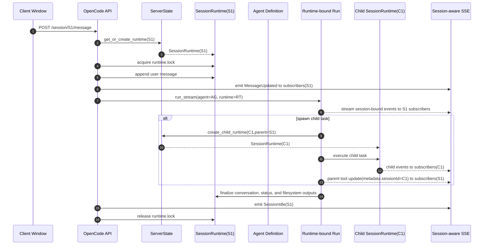

# RFC-0023: Session Runtime Hard Isolation for Multi-Window and Subagent Execution

## Overview

This RFC proposes moving session-sensitive runtime state out of shared agent instances and into explicit per-session runtime containers. The goal is to strengthen isolation across concurrent sessions, multiple OpenCode windows, parent/child subagent execution, and background worker flows without changing the external session model.

The current implementation already uses `session_id`, `parent_id`, per-session locks, and `RunSnapshot` to achieve logical isolation. However, some mutable state remains owned by the agent instance or by process-wide transport structures. This RFC evaluates three architectural options and recommends a staged move to `SessionRuntime` plus session-aware server-side event routing.

## Table of Contents

- [Background & Context](#background--context)
- [Problem Statement](#problem-statement)
- [Goals & Non-Goals](#goals--non-goals)
- [Evaluation Criteria](#evaluation-criteria)
- [Options Analysis](#options-analysis)
- [Recommendation](#recommendation)
- [Technical Design](#technical-design)
- [Security Considerations](#security-considerations)
- [Implementation Plan](#implementation-plan)
- [Open Questions](#open-questions)
- [Decision Record](#decision-record)
- [References](#references)

---

## Background & Context

### Current State

AgentPool currently runs OpenCode sessions inside a shared server process. Runtime state in `ServerState` is heavily partitioned by `session_id`, including message lists, todo state, conversation caches, input providers, and per-session locks. Subagent execution creates explicit child sessions linked via `parent_id` and event metadata.

When a message is processed, OpenCode acquires a per-session lock, applies short-lived agent mutations under `agent_lock`, captures a `RunSnapshot`, and then streams the run using snapshot-derived `session_id`, `conversation`, and `input_provider`. This reduces cross-session contamination during ordinary execution.

At the same time, several mutable fields remain instance-scoped on the agent or process-scoped on the server:

- `BaseAgent._active_run_ctx`
- `NativeAgent._iteration_task`
- `BaseAgent.conversation`
- `BaseAgent.internal_fs`
- global SSE subscriber fan-out in `ServerState.broadcast_event()`

### Historical Context

Two earlier RFCs are directly relevant:

1. **RFC-0014** introduced `SpawnSessionStart` and formalized child-session creation for subagent flows.
2. **RFC-0021** addressed concurrent execution safety at the per-run context level and documented that some shared instance state was unsafe under concurrent execution.

This RFC builds on those changes. It does not replace session tracking or subagent lineage. Instead, it hardens the ownership boundary of runtime state.

### Glossary

| Term | Definition |
|------|------------|
| Agent Definition | A reusable agent object that holds configuration, model capabilities, tools, and shared static dependencies |
| Session Runtime | A proposed per-session state container that owns conversation, execution state, and temporary resources |
| Logical Isolation | Correctness achieved by IDs, routing, locks, and conventions inside shared processes or objects |
| Hard Isolation | Correctness achieved by moving mutable state ownership to independently scoped runtime containers |
| Child Session | A subagent session with its own `session_id` and a `parent_id` referring to the spawning session |

---

## Problem Statement

### The Problem

The current architecture isolates most state by `session_id`, but it still relies on shared agent instances and shared server transport for part of its correctness. This creates a gap between the intended isolation model and the actual ownership model of mutable runtime state.

The result is not an immediate correctness failure in every case. The result is a system where cross-session correctness depends on multiple cooperating mechanisms remaining aligned:

- per-session locks
- short `agent_lock` critical sections
- consistent use of `RunSnapshot`
- careful event tagging with `sessionId`
- client-side filtering of globally broadcast events

### Evidence

The following observations are verified from the current implementation:

- `message_routes.py` serializes turns per session with `get_session_lock(session_id)`.
- `state.py` creates per-session `MessageHistory` and per-session `OpenCodeInputProvider` instances.
- `snapshot_for_session()` still binds `resolved.session_id` and `resolved._input_provider` on the shared agent before capturing the snapshot.
- `base_agent.py` logs that concurrent runs on a shared agent instance are not safe because `_active_run_ctx` is single-session state.
- `native_agent/agent.py` documents the same constraint for `_iteration_task`.
- `workers.py` temporarily replaces worker history in some execution modes, then restores it later.
- `broadcast_event()` fans events out to all SSE subscribers, while `global_routes.py` relies on `sessionId` extraction and client-side routing to associate events with windows.

### Impact of Inaction

If the ownership model remains unchanged:

- **Cost**: new features must continue threading through special-case locking, snapshotting, and restore logic
- **Risk**: new call paths may accidentally read or mutate instance-scoped state during concurrent multi-session runs
- **Opportunity**: server-side selective event delivery, session-local debug tooling, and stronger background-task isolation remain harder to implement

The main concern is architectural fragility rather than a single isolated bug. The current design works under disciplined usage, but it is easier to regress than a model where runtime state ownership is explicit.

---

## Goals & Non-Goals

### Goals (In Scope)

1. Move session-sensitive mutable runtime state to an explicit per-session container.
2. Preserve the existing external session model (`session_id`, `parent_id`, child session lineage).
3. Eliminate the need to bind shared agent instance state before snapshot capture.
4. Replace client-only event isolation with server-side session-aware event delivery.
5. Remove execution paths that temporarily overwrite another runtime's conversation/history.

### Non-Goals (Out of Scope)

1. Redesigning the AgentPool storage model or changing session primary keys.
2. Replacing the existing parent/child session UI model in OpenCode.
3. Solving distributed execution, thread safety, or cross-process scheduling.
4. Changing model provider semantics beyond what is required for session-local execution configuration.
5. Rewriting all agent backends at once; the design must support staged migration.

### Success Criteria

How will we know this RFC achieved its goals?

- [ ] Concurrent sessions using the same agent definition no longer share conversation, internal filesystem, or run-task ownership.
- [ ] Worker and subagent flows do not mutate another runtime's history in place.
- [ ] Session-bound SSE events are delivered server-side only to subscribers for that session, plus optional global subscribers.
- [ ] `snapshot_for_session()` no longer mutates shared agent instance session fields before producing a run snapshot.
- [ ] Parent and child sessions still preserve lineage and UI behavior after migration.

---

## Evaluation Criteria

The following criteria will be used to objectively evaluate each option:

| Criterion | Weight | Description | Minimum Threshold |
|-----------|--------|-------------|-------------------|
| Isolation Strength | High | Degree to which mutable runtime state is owned per session rather than shared | Session-local ownership for conversation, run context, and temporary files |
| Backward Compatibility | High | Ability to preserve session APIs, storage shape, and current client behavior | No breaking OpenCode route or storage changes |
| Implementation Risk | Medium | Probability of regressions during migration | Can be staged with compatibility shims |
| Operational Simplicity | Medium | Ease of debugging, tracing, and canceling session-specific work | Per-session ownership must improve observability |
| Performance | Medium | Impact on throughput, latency, and resource use | No requirement for global serialization across sessions |
| Extensibility | Medium | Ability to support future subagent, background worker, and window-routing features | New features should not rely on shared instance mutation |

---

## Options Analysis

### Option 1: Keep Shared Agent Instances and Add More Guards

**Description**

Retain the current ownership model and continue improving correctness with additional locks, invariants, assertions, and helper wrappers. Under this option, `ServerState` remains the primary partitioning layer, while agent instances continue to hold some mutable execution state.

**Advantages**

- Smallest implementation delta from the current codebase.
- Keeps current agent backend interfaces largely unchanged.
- Can reduce some short-term risk by tightening discipline around known unsafe paths.

**Disadvantages**

- Does not change the underlying ownership mismatch between sessions and shared instance state.
- Leaves correctness dependent on all future call paths honoring locking and snapshot discipline.
- Preserves client-side dependence on filtering globally broadcast session events.

**Evaluation Against Criteria**

| Criterion | Rating | Notes |
|-----------|--------|-------|
| Isolation Strength | Low | State remains partially instance-scoped |
| Backward Compatibility | High | Minimal interface change |
| Implementation Risk | Medium | Low code churn, but continued hidden coupling |
| Operational Simplicity | Medium | Debugging remains split across shared instance and session buckets |
| Performance | High | No structural overhead beyond more checks |
| Extensibility | Low | Future features still depend on shared mutable state conventions |

**Effort Estimate**

- Complexity: Low
- Resources: 1 engineer, 3-5 days
- Dependencies: auditing unsafe paths, adding tests and assertions

**Risk Assessment**

| Risk | Likelihood | Impact | Mitigation |
|------|------------|--------|------------|
| Residual cross-session coupling remains | High | High | Add more assertions and tests |
| Future regressions reintroduce unsafe reads | Medium | High | Code review checklists and runtime warnings |

---

### Option 2: Introduce Per-Session Runtime Containers (Recommended)

**Description**

Introduce a first-class `SessionRuntime` object that owns all session-sensitive mutable execution state. Agent objects become reusable definitions that execute against a supplied runtime rather than storing session state internally.

Representative fields for `SessionRuntime`:

```python
@dataclass
class SessionRuntime:
    session_id: str
    parent_session_id: str | None
    conversation: MessageHistory
    input_provider: OpenCodeInputProvider
    internal_fs: IsolatedMemoryFileSystem
    active_run_ctx: AgentRunContext | None
    iteration_task: asyncio.Task[Any] | None
    lock: asyncio.Lock
    queued_prompts: list[QueuedAsyncPrompt]
    status: SessionStatus
    child_sessions: set[str]
```

**Advantages**

- Aligns ownership boundaries with the isolation model already implied by `session_id`.
- Removes the need to bind shared agent state before snapshot capture.
- Provides a clean home for session-local filesystem, cancellation, async queue, and runtime metrics.

**Disadvantages**

- Requires interface changes in agents, workers, and protocol adapters.
- Introduces a migration period where compatibility shims may coexist with the new runtime model.
- Some backends may need adapter code if they currently assume instance-owned state.

**Evaluation Against Criteria**

| Criterion | Rating | Notes |
|-----------|--------|-------|
| Isolation Strength | High | Runtime ownership becomes session-local |
| Backward Compatibility | Medium | External APIs can remain stable, internal APIs will change |
| Implementation Risk | Medium | Migration must be staged carefully |
| Operational Simplicity | High | Session ownership becomes explicit and easier to inspect |
| Performance | Medium | Modest extra runtime objects; avoids global serialization |
| Extensibility | High | Child sessions, tracing, and routing all become easier to extend |

**Effort Estimate**

- Complexity: High
- Resources: 1-2 engineers, 2-4 weeks
- Dependencies: runtime abstraction, backend shims, focused regression tests

**Risk Assessment**

| Risk | Likelihood | Impact | Mitigation |
|------|------------|--------|------------|
| Migration complexity causes temporary dual-state confusion | Medium | High | Add deprecation shims and ownership assertions |
| Backend-specific assumptions break during migration | Medium | Medium | Use adapters and backend-by-backend rollout |

---

### Option 3: Clone Agent Instances Per Session

**Description**

Create a dedicated agent instance per session or per run. Instead of separating definition from runtime state, this option duplicates the agent object so mutable state is no longer shared.

**Advantages**

- Stronger isolation than the current design without redesigning internal ownership as deeply as Option 2.
- Can reduce contention around instance-scoped fields by construction.
- May be easier for some backends that strongly assume instance-local execution state.

**Disadvantages**

- Duplicates tools, providers, caches, and model-adapter state that may not need duplication.
- Increases memory and startup overhead proportional to session count.
- Leaves ambiguity around which state should be shared versus copied.

**Evaluation Against Criteria**

| Criterion | Rating | Notes |
|-----------|--------|-------|
| Isolation Strength | Medium | Stronger than today, but state-sharing policy remains implicit |
| Backward Compatibility | Medium | External APIs can stay stable, but lifecycle semantics change |
| Implementation Risk | Medium | Fewer interface changes than Option 2, but more lifecycle complexity |
| Operational Simplicity | Medium | Easier reasoning per instance, harder resource accounting |
| Performance | Low | More memory and setup work per session |
| Extensibility | Medium | Helps isolation, but does not create a reusable runtime abstraction |

**Effort Estimate**

- Complexity: Medium
- Resources: 1-2 engineers, 1-3 weeks
- Dependencies: instance factory logic, cache and provider lifecycle decisions

**Risk Assessment**

| Risk | Likelihood | Impact | Mitigation |
|------|------------|--------|------------|
| Session count multiplies resource use | Medium | Medium | Pool clones or add eviction policies |
| Shared-vs-copied state remains inconsistent | Medium | High | Define explicit clone semantics for each field |

---

### Options Comparison Summary

| Criterion | Option 1 | Option 2 | Option 3 |
|-----------|----------|----------|----------|
| Isolation Strength | Low | High | Medium |
| Backward Compatibility | High | Medium | Medium |
| Implementation Risk | Medium | Medium | Medium |
| Operational Simplicity | Medium | High | Medium |
| Performance | High | Medium | Low |
| Extensibility | Low | High | Medium |
| **Overall** | Short-term mitigation | Best long-term fit | Partial structural fix |

---

## Recommendation

### Recommended Option

**Option 2: Introduce Per-Session Runtime Containers**

### Justification

Option 2 scores highest against the criteria that matter most for this problem: isolation strength, operational clarity, and future extensibility. The current system already models sessions explicitly in storage, runtime buckets, and event lineage. A `SessionRuntime` design extends that same model to mutable execution ownership.

Option 1 is suitable as a short-term mitigation but does not resolve the architectural mismatch. Option 3 improves isolation but still leaves key ownership questions implicit and may duplicate more state than necessary. Based on the evidence in the current codebase, Option 2 is the smallest change that resolves the structural issue rather than only reducing exposure to it.

### Accepted Trade-offs

1. **Internal API churn**: Acceptable because the current API already passes snapshot and history objects explicitly, which creates a natural migration path toward runtime-based execution.
2. **Staged migration complexity**: Acceptable because compatibility shims can preserve external behavior while ownership is moved incrementally.

### Conditions

- The migration must preserve `session_id` / `parent_id` semantics and OpenCode route compatibility.
- Ownership changes must be introduced with regression tests covering multi-window, child-session, cancellation, and worker flows.
- Session-aware SSE routing should ship behind a compatibility flag until clients are validated.

---

## Technical Design

> Note: This section contains a preliminary design suitable for RFC review. Exact field names and adapters may change during implementation.

### Architecture Overview

The proposed design separates agent definition from session runtime.

```text
┌────────────────────┐
│    Client Window   │
└─────────┬──────────┘
          │ POST /session/{id}/message
          ▼
┌────────────────────┐
│   OpenCode API     │
└─────────┬──────────┘
          │ get_or_create_runtime(session_id)
          ▼
┌────────────────────┐        ┌────────────────────┐
│   ServerState      │───────▶│  SessionRuntime    │
│ session_runtimes   │        │ conversation       │
│ session_subscribers│        │ input_provider     │
└─────────┬──────────┘        │ internal_fs        │
          │                   │ active_run_ctx     │
          │ run(agent, runtime)│ iteration_task    │
          ▼                   └─────────┬──────────┘
┌────────────────────┐                  │
│  Agent Definition  │◀─────────────────┘
│ tools / model cfg  │
└────────────────────┘
```

### Proposed Data Model

New server-owned container:

```python
@dataclass
class SessionRuntime:
    session_id: str
    parent_session_id: str | None
    conversation: MessageHistory
    input_provider: OpenCodeInputProvider
    internal_fs: IsolatedMemoryFileSystem
    active_run_ctx: AgentRunContext | None = None
    iteration_task: asyncio.Task[Any] | None = None
    lock: asyncio.Lock = field(default_factory=asyncio.Lock)
    queued_prompts: list[QueuedAsyncPrompt] = field(default_factory=list)
    status: SessionStatus = field(default_factory=lambda: SessionStatus(type="idle"))
    child_sessions: set[str] = field(default_factory=set)
```

New `ServerState` fields:

```python
session_runtimes: dict[str, SessionRuntime]
global_subscribers: list[Queue[Event]]
session_subscribers: dict[str, list[Queue[Event]]]
```

### Execution Model

The runtime becomes the primary execution context:

```python
async def run_stream(
    self,
    *prompts: PromptCompatible,
    runtime: SessionRuntime,
    snapshot: RunSnapshot | None = None,
    execution_config: ExecutionConfig | None = None,
) -> AsyncIterator[RichAgentStreamEvent[Any]]:
    ...
```

Rules:

1. `run_stream()` must not write `self.session_id`, `self._input_provider`, `self._active_run_ctx`, `self._iteration_task`, `self.conversation`, or `self.internal_fs` as part of ordinary session execution.
2. Interrupt, cancellation, and async queue ownership move to `SessionRuntime`.
3. Snapshots are generated from `SessionRuntime`, not by mutating the shared agent first.

### Snapshot Model

`snapshot_for_session()` changes from bind-then-capture to runtime-derived capture:

```python
RunSnapshot(
    session_id=runtime.session_id,
    input_provider=runtime.input_provider,
    conversation=runtime.conversation,
    model_name=effective_model_name,
    mode_name=effective_mode_name,
)
```

### Worker and Subagent Inheritance

Worker and subagent execution must not overwrite another runtime's history in place. Instead, inheritance becomes explicit:

```python
history_copy = parent_runtime.conversation.copy()
child_runtime = create_child_runtime(child_session_id, parent_session_id=parent_runtime.session_id)
await child_agent.run_stream(..., runtime=child_runtime, inherited_history=history_copy)
```

Recommended inheritance modes:

- `NONE`
- `COPY_PARENT_VISIBLE_HISTORY`
- `COPY_PARENT_COMPACTED_HISTORY`
- `LINK_READONLY_PARENT_CONTEXT` (optional future extension)

### Server-Side Event Routing

Current behavior broadcasts every event to every subscriber. Proposed behavior:

1. Global events go only to `global_subscribers`.
2. Session-bound events go to `session_subscribers[session_id]` and optionally to global subscribers.
3. Event extraction rules remain the same, but routing is enforced server-side rather than delegated entirely to the client.

### Child Session Lifecycle

Child session lifecycle becomes explicit and runtime-backed:

1. `SpawnSessionStart` -> create child `SessionRuntime`
2. wrapped child events -> update child runtime and parent tool part
3. `StreamCompleteEvent` / cancellation / error -> finalize child runtime and parent state
4. runtime cleanup -> release child runtime resources when safe

### Sequence Diagram



---

## Security Considerations

This RFC is primarily about runtime correctness, but it has security and privacy implications.

1. **Event Delivery Scope**: server-side session-aware routing reduces unnecessary exposure of session-bound events to unrelated subscribers.
2. **Temporary Output Isolation**: per-session internal filesystems reduce accidental cross-session access to task output, debug artifacts, or tool-generated files.
3. **Cancellation Scope**: session-owned run state makes it easier to ensure interrupts and background-task cancellation only affect the intended session.
4. **Auditability**: explicit runtime ownership makes it easier to reason about which component wrote or read session-local data.

This RFC does not replace authentication or authorization. If clients with different trust boundaries share one server process, session-scoped event routing should be treated as necessary but not sufficient protection.

---

## Implementation Plan

### Phase 1: Safety Improvements Before Structural Migration

1. Add stronger guards against concurrent reuse of shared agent instance execution state.
2. Remove worker paths that overwrite another runtime's history in place.
3. Namespace temporary filesystem output by session and task ID even before `internal_fs` is fully moved.

### Phase 2: Introduce `SessionRuntime`

1. Add `SessionRuntime` and `ServerState.session_runtimes`.
2. Move conversation, input provider, async prompt queue, active run state, and temporary filesystem ownership into the runtime.
3. Preserve compatibility shims for older internal call paths during migration.

### Phase 3: Runtime-Native Execution

1. Update agent execution to accept a runtime object directly.
2. Change snapshot generation to derive from runtime, not from shared instance mutation.
3. Update interrupt and cancel flows to locate active work through the runtime.

### Phase 4: Session-Aware Event Delivery

1. Add global vs session-scoped subscriber registries.
2. Deliver session-bound events only to matching subscribers.
3. Keep compatibility mode available during rollout.

### Rollback Strategy

- Keep session-aware routing behind a feature flag until validated with the current OpenCode client.
- Maintain a compatibility shim for old execution entry points until tests confirm runtime-native paths are stable.
- Roll back phase-by-phase rather than in one large revert; each phase should remain independently deployable.

---

## Open Questions

1. Should model/mode selection become runtime-local execution configuration, or should some backends use lightweight clone-on-run behavior?
2. Which existing agent backends depend most heavily on instance-owned state and need adapters first?
3. Should child runtime cleanup be reference-counted, event-driven, or explicit on session close?
4. Do any current OpenCode clients depend on receiving globally broadcast session events beyond their active session?
5. Should `LINK_READONLY_PARENT_CONTEXT` be supported initially, or deferred until after runtime ownership is stable?

---

## Decision Record

**Current Status**: DRAFT

### Draft Decision

No final decision has been made yet. This RFC recommends Option 2 for review because it provides the strongest alignment between the current session model and runtime state ownership.

### Review Focus

Reviewers are asked to comment on:

1. Whether `SessionRuntime` is the right ownership boundary.
2. Whether any backend requires a different migration path.
3. Whether server-side event routing should be introduced in the same RFC or split into a follow-up RFC.

### Approval Conditions

- Agreement on the ownership boundary for session-sensitive state.
- Agreement on phased rollout and compatibility strategy.
- Agreement on the minimum regression test matrix for concurrent sessions, subagents, and multi-window routing.

---

## References

- `src/agentpool_server/opencode_server/state.py`
- `src/agentpool_server/opencode_server/routes/message_routes.py`
- `src/agentpool_server/opencode_server/routes/global_routes.py`
- `src/agentpool_server/opencode_server/event_processor.py`
- `src/agentpool/agents/base_agent.py`
- `src/agentpool/agents/native_agent/agent.py`
- `src/agentpool_toolsets/builtin/workers.py`
- `src/agentpool_toolsets/builtin/subagent_tools.py`
- `docs/rfcs/accepted/RFC-0014-spawn-session-events.md`
- `docs/rfcs/accepted/RFC-0021-agent-concurrent-execution-safety.md`
