# RFC-0051: Extension Source Architecture — Unifying Skill, MCP, and Command via Resource Protocols and Client Injection

## Table of Contents

- [Overview](#overview)
- [Background & Context](#background--context)
- [Problem Statement](#problem-statement)
- [Goals & Non-Goals](#goals--non-goals)
- [Evaluation Criteria](#evaluation-criteria)
- [Options Analysis](#options-analysis)
- [Recommendation](#recommendation)
- [Technical Design](#technical-design)
- [Security Considerations](#security-considerations)
- [Implementation Plan](#implementation-plan)
- [Open Questions](#open-questions)
- [Decision Record](#decision-record)
- [References](#references)

---

## Overview

AgentPool currently treats skills, MCP servers, and commands as three fundamentally different subsystems, each with its own discovery, lifecycle, scoping, and change-notification mechanisms. This separation has led to 7 structural problems (detailed in Problem Statement) where cross-provision scenarios — such as MCP-hosted skills and skill-embedded MCP servers — require ad-hoc workarounds that bypass the normal capability compilation pipeline.

This RFC proposes **domain-specific Resource Protocol interfaces** and **client dependency injection** as the unifying architecture. The key insight: **protocol clients** (MCPClient, or None for local) are injected into capabilities as constructor parameters. The client determines HOW data is accessed; the Resource Protocol determines WHAT is provided. There is no separate "transport" abstraction — protocol server/client pairs (MCP, OpenCode) ARE the transport.

Three concepts replace the previous 4-dimension design:

1. **Resource Protocols** (WHAT): `SkillResource`, `McpResource`, `CommandResource` — domain-specific interfaces declaring domain-specific methods
2. **Client Injection** (HOW): `MCPClient`, or `None` (local) — injected into capabilities as constructor parameters
3. **Scope** (VISIBILITY): Pool > Session > Agent > Turn — `ExtensionRegistry` resolves visible capabilities by walking scope chain

`AbstractCapability` remains as the pydantic-ai adapter layer. Existing `MCPCapability` becomes `McpServerCap`. `SkillCapability`, `SkillActivationCapability`, and `LocalSkillCap` are merged into `SkillManagerCap`.

**Expected outcome**: A single `ExtensionRegistry` replaces the fragmented `SkillProvider`, `SkillURIResolver._providers`, `SkillMcpManager`, and `AggregatedResourceSource` construction logic. Cross-provision scenarios become first-class composition patterns rather than special cases.

---

## Background & Context

### Current State

AgentPool's extension ecosystem consists of three subsystems that evolved independently:

#### Skill Subsystem

| Component | File | Role |
|-----------|------|------|
| `Skill` | `skills/skill.py:32` | Data model: name, description, instructions, mcp_servers, tools, allowed_tools |
| `SkillsRegistry` | `skills/registry.py:26` | Filesystem discovery from `DEFAULT_SKILL_PATHS`, on_skill_added/removed callbacks |
| `SkillsManager` | `skills/manager.py:26` | Owns registry + config, async context manager |
| `SkillCapability` | `skills/capability.py:49` | Wraps one Skill as pydantic-ai `AbstractCapability`. Implements `ResourceSource`. `build_config_entries()` emits `McpConfigEntry(source="skill")` |
| `SkillMcpManager` | `skills/skill_mcp_manager.py:31` | Per-skill MCP lifecycle: `_providers[session_id][server_name]`, lazy connect with 3 retries + 5min idle timeout |
| `SkillToolManager` | `skills/skill_tool_manager.py:18` | Eager Python tool import (no caching) |
| `SkillCommand` | `skills/command.py:14` | Frozen dataclass wrapping skill as slash command |
| `SkillCommandRegistry` | `skills/command_registry.py:32` | Dual sync: MCP provider first, local registry second (local wins) |
| `SkillURIResolver` | `skills/uri_resolver.py:298` | Resolves `skill://` URIs via `SkillProvider` Protocol. Fuzzy matching with `_` ↔ `-` |
| `SkillActivationCapability` | `capabilities/skill_activation.py:62` | Per-turn dynamic skill injection via `before_model_request` hook |
| `SkillsTools` | `toolsets/builtin/skills.py:540` | `load_skill` + `list_skills` tools, injection mode config |

#### MCP Subsystem

| Component | Role |
|-----------|------|
| `MCPManager` + `GlobalConnectionPool` | Pool-level: shared stdio transports across sessions |
| `SessionConnectionPool` | Session-level: per-session connection management |
| `McpConfigSnapshot` | Partitions configs: pool, agent, session, skill (4-level) |
| `MCPCapability` | Wraps MCP server config as `AbstractCapability` |
| `MCPClient` | MCP protocol implementation (tools/call, resources/read, prompts/get) |

#### Command Subsystem

Commands are currently derived from skills (`SkillCommand` wrapping `Skill`). There is no standalone command source — commands are a byproduct of skill discovery.

#### AgentPool Integration

`AgentPool` (pool.py) owns all skill infrastructure through lazy properties:

```python
# Lazy fields on AgentPool
_skill_commands: SkillCommandRegistry
_skill_resolver: SkillURIResolver
_skill_provider: CombinedToolsetCapability  # exposes skills as tools
_skill_mcp_manager: SkillMcpManager
_skill_tool_manager: SkillToolManager
_skill_capabilities: list[SkillCapability]
_default_skill_scope: str
_node_skill_scopes: dict[str, set[str]]
_skill_scope_paths: dict[str, list[str]]
```

Startup sequence: `mcp.__aenter__()` → `skills.__aenter__()` → `_setup_skills_provider()` → `SkillCommandRegistry.initialize()` → `_rebuild_skill_capabilities()`.

Scoping: `skill_scope_for_node()` / `skill_scope_for_skill()` / `is_skill_visible_to_node()` — path-based package-level isolation, pool-level only (no session-level scoping).

### MCP Multi-Level Architecture (Reference Pattern)

The MCP subsystem already has a 4-level partition that serves as a proven pattern:

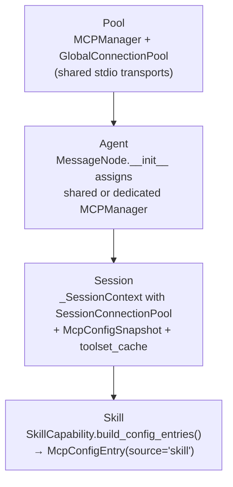

`McpConfigSnapshot` partitions configs into:
- `global_configs` = pool + agent (shared across sessions)
- `session_scoped_configs` = session + skill (per-session)
- `with_skill_configs()` returns new snapshot with replaced skill configs

### Research Findings

Eight parallel research agents investigated extension systems across AI frameworks, MCP specifications, software engineering patterns, and local frameworks:

**AI Agent Frameworks**: Claude Code, Cursor, LangChain, AutoGen/CrewAI all lack a unified abstraction for tools/skills/commands/MCP. Only VS Code (Contribution Points) and Zed (Extension trait + WASM) achieve true unification, but both are editors, not agent frameworks. MCP is winning as the cross-cutting transport layer (OpenAI adopted MCP in March 2025).

**MCP + Skill Unification**: SEP-2640 proposes MCP servers provide skills via `skill://` URI scheme using existing MCP resources primitive. A unified internal registry merges filesystem skills + MCP-hosted skills so the model cannot distinguish the source. MCP defines 3 server-side primitives: tools (model-controlled), resources (app-controlled), prompts (user-controlled).

**Software Extension Patterns**: VS Code's Contribution Points (static manifest + lazy activation, ~40 contribution types through one Registry), Eclipse's Extension Registry (schema-typed extension points, three-participant model), IntelliJ's Bean vs Interface (two fundamental extension kinds, `dynamic="true"` for runtime changes), Blender's Operator (register/unregister lifecycle pair, `poll()` for visibility), Django's phased startup (deterministic registry population with readiness checks), Flask's per-app scoping (no global state, `init_app(app)`), Rust's Trait as Contract (type-safe extension definition, object safety discipline), DI's Scope Hierarchy (Singleton/Scoped/Transient, child scopes resolve from parent).

**oh-my-openagent**: No unified Provider/Extension/Capability abstraction — pipeline architecture. Skills auto-become commands. 8 discovery sources with scope priority. 3 MCP pathways. 55+ lifecycle hooks.

**OpenCode**: Hook-based plugin system, no unified abstraction. Each extension type has its own registration mechanism.

**DeerFlow**: Three separate extension types (tools, MCP, skills), NO unified abstraction. Notable patterns: deferred discovery (tool names in prompt, schemas fetched on demand), hot reload (mtime + content hash polling, `reload_boundary.py`), skill security scanning (zip-bomb/traversal/binary exec), per-user skill storage.

**LangChain**: Six separate concepts (BaseTool, BaseToolkit, AgentMiddleware, ToolCallInterceptor, SKILL.md, MultiServerMCPClient), NO unified abstraction. `BaseTool(RunnableSerializable)` as universal tool interface. Middleware for dynamic tool filtering. `InjectedToolArg` for runtime DI. No hot reload.

**LangGraph**: NO plugin/extension system. `ToolNode` wraps `BaseTool` collection, fixed at construction — no runtime `add_tool()`. Graph topology fixed at `compile()` time. Channel-based state scoping (LastValue, EphemeralValue, etc.). Subgraph-as-Node for composition. `Command(update={...}, goto="node")` for state+control flow.

**Cross-framework comparison**: All eight frameworks lack a unified extension abstraction. AgentPool's RFC-0051 proposal is ahead of all of them in unification. The most valuable reference patterns are: DeerFlow's deferred discovery + hot reload boundary, LangChain's middleware dynamic tool filtering, and LangGraph's Channel scoping + Command composition.

### Glossary

| Term | Definition |
|------|------------|
| **Resource Protocol** | A domain-specific `@runtime_checkable` Protocol declaring what a capability provides: `SkillResource`, `McpResource`, `CommandResource` |
| **Client** | A protocol client object injected into capabilities: `MCPClient`, or `None` (for local sources). The client determines HOW data is accessed. |
| **Client Injection (DI)** | Pattern where capabilities receive clients as constructor parameters, replacing a separate transport abstraction |
| **Composition** | Parent-child relationship between capabilities: independent clients = aggregation (partial failure OK) |
| **Scope** | Visibility level: pool, session, agent, turn |
| **ExtensionRegistry** | Central registry that holds all capabilities, resolves URIs, and routes queries by Resource Protocol type |
| **AbstractCapability** | pydantic-ai's extension point; capabilities implement Resource Protocols AND AbstractCapability |

---

## Problem Statement

### 7 Structural Problems

The current architecture produces 7 concrete problems, each with evidence:

#### Problem 1: SkillCapability bypasses AggregatedResourceSource

`SkillCapability` is injected via `get_agentlet()` at runtime, bypassing `AgentFactory.compile()`. Skill content is not queryable via `AgentContext.resources`.

**Evidence**: `AgentFactory.compile()` builds capabilities from config, but `SkillCapability` instances are added post-compilation through a separate code path. `AgentContext.resources` (the `AggregatedResourceSource`) does not include skill content.

**Impact**: Any code that queries `AgentContext.resources.list()` cannot see skill-provided resources. The URI resolver must use a separate `SkillProvider` Protocol, creating dual lookup paths.

#### Problem 2: MCPCapability does not implement SkillProvider

`skill://` URIs cannot resolve to MCP-hosted skills. `pool.py:570-600` has registration logic that checks `isinstance(capability, SkillProvider)`, but `MCPCapability` never implements this Protocol.

**Evidence**: `MCPCapability` (capabilities/mcp_capability.py) does not implement `SkillProvider`. The isinstance check at `pool.py:570` always returns `False` for MCP capabilities.

**Impact**: Skills hosted on remote MCP servers (via SEP-2640 resource-based skills) are invisible to the `skill://` URI resolver. Users cannot load skills from MCP servers even though the MCP protocol supports it.

#### Problem 3: MCP-produced skills have commands but no capability

`SkillCommandRegistry` syncs commands from MCP (via provider), but `_rebuild_skill_capabilities()` only iterates the local `SkillsRegistry`. MCP-sourced skills get slash commands but no `SkillCapability`, so they lack instruction injection and resource access.

**Evidence**: `_rebuild_skill_capabilities()` (pool.py) iterates `self._skills.registry.items()` only. `SkillCommandRegistry.initialize()` syncs from MCP providers first, then local registry.

**Impact**: A user types `/remote-skill` and gets the slash command, but the skill's instructions are never injected into the agent's prompt. The skill exists as a command but not as a capability.

#### Problem 4: Change notification chain is broken

`MCPCapability.on_change()` fires `ChangeEvent(kind="tools_changed")`, which reaches `AgentFactory._start_hot_swap_listeners()`. But this listener only logs the event — it does not trigger skill re-discovery. `CombinedToolsetCapability` lacks a `skills_changed` signal. `SkillCommandRegistry` subscribes to a non-existent signal.

**Evidence**: `AgentFactory._start_hot_swap_listeners()` (host/factory.py) logs warnings but does not call `_rebuild_skill_capabilities()`. `SkillCommandRegistry.__init__` subscribes to `skills_changed` signal, but no code emits this signal.

**Impact**: When an MCP server adds or removes tools, the change propagates to the capability layer but stops there. Skills are never re-evaluated. Slash commands from MCP-hosted skills never update after initial load.

#### Problem 5: SkillMcpManager has dual connection paths

`SkillMcpManager` maintains its own `(session_id, server_name) → connection` map with 5-minute idle timeout. Separately, `_build_mcp_toolsets_from_pool()` uses `SessionConnectionPool`. Two code paths manage the same MCP connections with different lifecycle semantics.

**Evidence**: `SkillMcpManager._providers` (skills/skill_mcp_manager.py:31) vs `SessionConnectionPool` (mcp/session_pool.py). `SkillCapability._build_mcp_toolsets()` can go through either path.

**Impact**: MCP connections may be duplicated (one in each pool), wasting file descriptors and memory. Connection cleanup is inconsistent — the 5-minute timeout in `SkillMcpManager` may close a connection that `SessionConnectionPool` still considers active.

#### Problem 6: Scoping is pool-level only

No session-level skill scoping exists. All sessions see the same set of skills. `skill_scope_for_node()` filters by node path (package-level), not by session.

**Evidence**: `_node_skill_scopes` is a `dict[str, set[str]]` on `AgentPool`, keyed by node name. There is no `_session_skill_scopes` or equivalent.

**Impact**: In a multi-tenant scenario (M5), different tenants cannot have different skill sets. Even in single-tenant mode, a long-running session that should have isolated skills cannot do so.

#### Problem 7: No filesystem watcher

`SkillsRegistry` is passive. `register_skills_from_path()` does a full re-discovery on each call. There is no `watchdog` or similar filesystem watcher to detect new/removed skill files.

**Evidence**: `SkillsRegistry.discover_skills()` (skills/registry.py) scans `DEFAULT_SKILL_PATHS` and returns a list. No `watchdog.Observer` or `inotify` integration exists.

**Impact**: New skills added to `~/.claude/skills/` after startup are invisible until manual re-discovery. In a development workflow, this means editing a skill requires restarting the server.

### Impact of Not Solving

| Problem | Cost of Inaction |
|---------|-----------------|
| P1 + P3 | Skills are second-class citizens — some features work for local skills but not MCP-hosted skills |
| P2 | `skill://` URIs only resolve locally, blocking SEP-2640 adoption |
| P4 | Hot reload is broken — MCP tool changes require server restart |
| P5 | Resource leaks (duplicate connections), race conditions (two pools disagreeing on state) |
| P6 | Blocks M5 (multi-tenant) — no way to isolate skills per tenant |
| P7 | Poor DX — editing a skill requires server restart |

---

## Goals & Non-Goals

### Goals

1. **Define domain-specific Resource Protocols** (`SkillResource`, `McpResource`, `CommandResource`) that unify what skills, MCP, and commands provide
2. **Replace fragmented infrastructure** (SkillProvider, SkillURIResolver._providers, SkillMcpManager dual-path) with a single `ExtensionRegistry`
3. **Support cross-provision scenarios** as first-class composition patterns (MCP-hosted skills, skill-embedded MCP)
4. **Preserve `AbstractCapability`** as the adapter layer — no changes to pydantic-ai integration
5. **Add session-level scoping** to enable M5 multi-tenant preparation
6. **Fix all 7 structural problems** through the unified architecture
7. **Enable filesystem watching** for skill hot-reload

### Non-Goals

1. **Redesign pydantic-ai's Toolset system** — `AbstractCapability` and its `get_toolset()` contract remain unchanged
2. **Create a separate transport abstraction** — protocol clients (MCPClient) ARE the transport. No `ExtensionTransport` Protocol or `TransportHandle`
3. **Implement multi-tenant (M5)** — this RFC prepares for it by adding session-level scoping, but does not build tenant isolation
4. **Replace MCP protocol implementation** — `MCPClient` stays, injected into capabilities
5. **Backward-compatible YAML config** — config changes are acceptable if migration is documented. Existing configs should work with deprecation warnings
6. **Performance optimization** — no benchmarks required for initial design. Correctness and architectural clarity are the priority

---

## Evaluation Criteria

| Criterion | Weight | Description | Measurement |
|-----------|--------|-------------|-------------|
| **Structural problem coverage** | 30% | How many of P1-P7 are solved | Count of problems resolved |
| **Cross-provision support** | 20% | Can MCP→skill, skill→MCP, MCP→command all be expressed | Scenario matrix |
| **Migration risk** | 15% | How much existing code must change, and how reversible it is | LOC changed + rollback complexity |
| **Architectural clarity** | 15% | Number of concepts to learn, orthogonality of design | Concept count + dependency graph depth |
| **Extensibility** | 10% | Can new source types be added without core changes | Open/closed compliance |
| **Lifecycle correctness** | 10% | Connection pooling, hot reload, partial failure handling | Scenario analysis |

---

## Options Analysis

### Option A: Status Quo with Incremental Fixes

**Description**: Keep the current three-subsystem architecture. Fix each problem independently:
- P1: Add SkillCapability to AggregatedResourceSource post-compilation
- P2: Make MCPCapability implement SkillProvider
- P3: Iterate MCP providers in `_rebuild_skill_capabilities()`
- P4: Wire `ChangeEvent` to skill re-discovery
- P5: Unify SkillMcpManager into SessionConnectionPool
- P6: Add `_session_skill_scopes` dict
- P7: Add watchdog observer to SkillsRegistry

**Advantages**:
- Minimal architectural change — each fix is localized
- No new abstractions to learn
- Each fix can ship independently
- Low coordination cost

**Disadvantages**:
- Does not address root cause: three subsystems with duplicated patterns
- P2 and P3 require MCPCapability to know about skills (tight coupling)
- P4 requires wiring across subsystem boundaries (fragile)
- Future extension types (e.g., ACP-hosted commands) require more patches
- The "fix list" grows with every new cross-provision scenario

**Evaluation Against Criteria**:

| Criterion | Score | Notes |
|-----------|-------|-------|
| Structural problem coverage | 7/7 | All fixable, but independently |
| Cross-provision support | 2/4 | Only existing scenarios; new ones need patches |
| Migration risk | 5/5 | Minimal changes, fully reversible |
| Architectural clarity | 2/5 | Still 3 subsystems, duplicated patterns |
| Extensibility | 2/5 | New source types need core changes |
| Lifecycle correctness | 3/5 | P5 unifies connections, but P4 wiring is fragile |

**Effort Estimate**: Medium. ~500-800 LOC across 7 fixes.

**Risk Assessment**: Low per-fix, but architectural debt accumulates. Each future cross-provision scenario requires another patch, increasing maintenance cost over time.

---

### Option B: Resource Protocols + Client Injection

**Description**: Introduce domain-specific Resource Protocol interfaces and client dependency injection, replacing the fragmented three-subsystem architecture with three concepts:

1. **Resource Protocols** (WHAT a capability provides):
   - `SkillResource` — `list_skills()`, `read_skill(uri)`
   - `McpResource` — `list_tools()`, `call_tool(name, args)`, `read_resource(uri)`
   - `CommandResource` — `list_commands()`, `get_command(name, args)`

2. **Client Injection** (HOW data is accessed):
   - Capabilities receive `MCPClient` or `None` (local) as constructor parameters
   - The client IS the transport — no separate abstraction needed

3. **Scope** (VISIBILITY):
   - Pool > Session > Agent > Turn
   - `ExtensionRegistry` resolves visible capabilities by walking scope chain

Capabilities implement `AbstractCapability` (pydantic-ai's interface) PLUS any combination of Resource Protocols. The `ExtensionRegistry` queries capabilities by `isinstance(cap, SkillResource)` etc.

**Composition via client sharing**: No separate `AggregatingSource` or `TunnelingSource` classes. Instead:
- Independent clients = aggregation (skill → MCP server with its own `MCPClient`, partial failure OK)

**Advantages**:
- Addresses root cause: one pattern (Resource Protocols + DI) for all extension types
- Cross-provision scenarios are natural composition, not special cases
- New source types require zero core changes — implement Resource Protocol, inject client, register
- No transport abstraction — protocol clients ARE the transport, eliminating conceptual overhead
- Connection pooling centralized in `SessionConnectionPool` (manages client reuse, not abstract transports)
- Scoping is built-in, enabling M5 preparation
- URI routing is unified (one registry, all schemes)
- Clear separation: Resource Protocols (what's available) → AbstractCapability (pydantic-ai adapter) → Agent (compiled toolset)

**Disadvantages**:
- Architectural change — new Resource Protocols, new registry, new DI pattern
- Migration requires rewriting MCPCapability and SkillCapability to use client injection
- `isinstance()` checks on Resource Protocols require capabilities to actually implement them (not just wrap)
- Learning curve: developers must understand Resource Protocols + client injection vs 3 subsystems
- Some capabilities may implement multiple Resource Protocols, requiring careful interface design

**Evaluation Against Criteria**:

| Criterion | Score | Notes |
|-----------|-------|-------|
| Structural problem coverage | 7/7 | All solved through unified architecture |
| Cross-provision support | 4/4 | All existing + future scenarios expressible |
| Migration risk | 3/5 | Moderate change, but simpler than 4-dimension design |
| Architectural clarity | 5/5 | 3 concepts (Resource Protocols + Client DI + Scope), no transport abstraction |
| Extensibility | 5/5 | New source types: implement Resource Protocol, inject client, register |
| Lifecycle correctness | 5/5 | Centralized pooling, unified change notifications |

**Effort Estimate**: Medium-Large. ~1500-2500 LOC across 4 phases. Phased migration allows shipping incrementally. Simpler than the previous 4-dimension design due to no Transport abstraction.

**Risk Assessment**: Medium. Phased migration reduces risk. Each phase delivers value independently. Main risk is Resource Protocol interface design — if methods are too generic, they lose domain specificity; if too specific, they don't unify. Mitigation: start with Phase 1 (MCP only) to validate interface design.

---

### Option C: MCP-as-Universal-Transport

**Description**: Make all extensions speak MCP internally. Local skills are wrapped as in-process MCP servers. Commands are exposed as MCP prompts. The existing MCP infrastructure (`MCPManager`, `SessionConnectionPool`, `McpConfigSnapshot`) handles all lifecycle concerns.

**Advantages**:
- Reuses existing, proven MCP infrastructure
- One protocol to learn (MCP)
- Cross-provision is automatic (everything IS MCP)
- Transport pooling already works

**Disadvantages**:
- Forces local skills through MCP serialization overhead (JSON-RPC for in-process calls)
- MCP's 3 primitives (tools, resources, prompts) do not map cleanly to AgentPool's needs (instructions, change notifications, filesystem watching)
- Local skills lose direct Python object access (must serialize through MCP)
- MCP protocol versioning becomes a dependency for all extensions
- Contradicts the design principle: local sources should not pay a protocol tax for being local

**Evaluation Against Criteria**:

| Criterion | Score | Notes |
|-----------|-------|-------|
| Structural problem coverage | 6/7 | P7 (FS watcher) still needed; P6 (scoping) not addressed by MCP |
| Cross-provision support | 3/4 | MCP→MCP trivial; local→MCP forced, ACP→MCP needs adapter |
| Migration risk | 1/5 | Every local skill needs MCP wrapper, high blast radius |
| Architectural clarity | 3/5 | One protocol, but forces unfit mapping |
| Extensibility | 3/5 | New types must fit MCP primitives |
| Lifecycle correctness | 4/5 | MCP lifecycle is proven, but local wrapping adds overhead |

**Effort Estimate**: Large. ~1500-2500 LOC. Every local skill path needs MCP wrapping.

**Risk Assessment**: High. Performance regression risk (JSON-RPC for in-process calls). Developer experience regression (local skills become harder to debug). MCP protocol changes could break all extensions.

---

## Recommendation

Based on the evaluation criteria, **Option B (Resource Protocols + Client Injection)** is recommended.

### Justification

Option B scores highest on architectural clarity (5/5), extensibility (5/5), and lifecycle correctness (5/5) — the three criteria most important for long-term maintainability. It is the only option that solves all 7 problems while also enabling future cross-provision scenarios without core changes.

Option A (incremental fixes) is tempting for its low migration risk, but it does not address the root cause: three subsystems with duplicated patterns. Each future cross-provision scenario would require another patch, and the "fix list" would grow indefinitely.

Option C (MCP-as-universal-transport) is explicitly rejected because it forces local sources through MCP serialization, which contradicts the design principle that local sources should not pay a protocol tax for being local.

### Acknowledged Trade-offs

1. **Migration effort**: Option B requires ~1500-2500 LOC across 4 phases. This is mitigated by phased delivery — each phase ships independently and delivers value.
2. **Interface design risk**: Resource Protocols must be domain-specific enough to be useful but general enough to unify. This is mitigated by starting with Phase 1 (MCP only) to validate interface design before expanding.
3. **isinstance() discipline**: The registry relies on `isinstance(cap, SkillResource)` checks. Capabilities must genuinely implement these Protocols, not just wrap them. This is a design feature, not a bug — it enforces the contract.

---

## Technical Design

### Architecture Overview

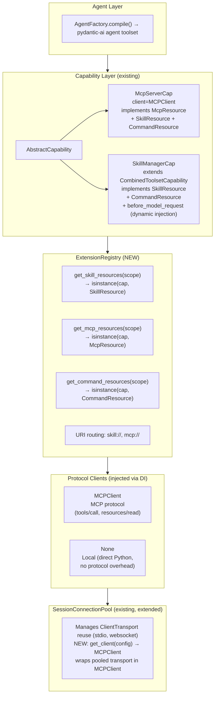

### Resource Protocol Interfaces

Three domain-specific `@runtime_checkable` Protocols describe what a capability provides. A fourth Protocol (`ChangeObservable`) provides change notification. Capabilities implement any combination.

```python
from __future__ import annotations
from typing import Protocol, runtime_checkable, AsyncIterator
from collections.abc import Sequence

@runtime_checkable
class SkillResource(Protocol):
    """Provides skill content (SKILL.md, references, instructions)."""

    async def list_skills(self) -> Sequence[SkillEntry]:
        """List available skills."""
        ...

    async def read_skill(self, uri: str) -> str | None:
        """Read skill content by URI (skill://name/SKILL.md)."""
        ...

    async def skill_exists(self, uri: str) -> bool:
        """Check if a skill URI exists. Used for URI routing before read_skill()."""
        ...

@runtime_checkable
class McpResource(Protocol):
    """Provides MCP-style tools and resources."""

    async def list_tools(self) -> Sequence[ToolEntry]:
        """List available tools with schemas."""
        ...

    async def call_tool(self, name: str, args: dict) -> ToolResult:
        """Execute a tool by name."""
        ...

    async def list_resources(self) -> Sequence[ResourceEntry]:
        """List available MCP resources (maps to MCP resources/list)."""
        ...

    async def read_resource(self, uri: str) -> str | bytes | None:
        """Read an MCP resource by URI."""
        ...

    async def resource_exists(self, uri: str) -> bool:
        """Check if an MCP resource URI exists. Used for URI routing before read_resource()."""
        ...

@runtime_checkable
class CommandResource(Protocol):
    """Provides user-triggered commands (slash commands, MCP prompts)."""

    async def list_commands(self) -> Sequence[CommandEntry]:
        """List available commands."""
        ...

    async def get_command(self, name: str, args: list[str]) -> str:
        """Resolve command to prompt/content."""
        ...

@runtime_checkable
class ChangeObservable(Protocol):
    """Provides change notifications. Capabilities implement this alongside
    their Resource Protocols to enable hot reload and change propagation.

    This replaces the on_change() method previously on ResourceSource.
    The ExtensionRegistry merges on_change() streams from all observable
    capabilities (replacing AggregatedResourceSource.on_change()).
    """

    def on_change(self) -> AsyncIterator[ChangeEvent] | None:
        """Stream of change notifications, or None if not observable."""
        ...
```

**Design note on `ChangeObservable`**: The existing `ResourceSource` protocol had `on_change()` as a required method. In the new design, `on_change()` is split into a separate `ChangeObservable` Protocol because not all capabilities need change notifications (e.g., static local tools). The `ExtensionRegistry.get_observable_capabilities(scope)` method returns capabilities implementing `ChangeObservable`, and the registry merges their streams — directly replacing `AggregatedResourceSource.on_change()` merge logic.

**Design note on `skill_exists()`**: The existing `ResourceSource.exists(uri)` is used by `AggregatedResourceSource.read()` to route URIs to the correct source (O(n) cheap checks before expensive reads). Without `exists()`, URI resolution would try `read_skill()` on each capability until one returns non-None — O(n) network calls. `skill_exists()` restores the cheap-check-first pattern. For local skills, this is a filesystem check; for MCP-hosted skills, it checks a cached resource listing.

**Data structures**:

```python
from dataclasses import dataclass, field

@dataclass(frozen=True)
class SkillEntry:
    uri: str           # e.g., "skill://ponytail/SKILL.md"
    name: str          # e.g., "ponytail"
    description: str
    mime_type: str = "text/markdown"

@dataclass(frozen=True)
class ResourceEntry:
    """An MCP resource entry (maps to MCP resources/list)."""
    uri: str
    name: str
    description: str
    mime_type: str = "text/markdown"

@dataclass(frozen=True)
class ToolEntry:
    name: str
    description: str
    input_schema: dict  # JSON Schema

@dataclass(frozen=True)
class ToolResult:
    content: str | bytes  # str for text results, bytes for binary (images, etc.)
    is_error: bool = False

@dataclass(frozen=True)
class CommandEntry:
    name: str           # e.g., "ponytail"
    description: str
    arguments: tuple[str, ...] = ()  # Immutable, avoids mutable default bug

@dataclass(frozen=True, slots=True)
class ChangeEvent:
    """Extends the existing ChangeEvent (capabilities/change_event.py).

    Migration from existing codebase:
    - `capability_name` is retained for backward compatibility.
    - `source_uri` is added for URI-level routing (e.g., "mcp://github").
    - `kind` is widened from `Literal["tools_changed"]` to `str` to support
      new event types: "resources_changed", "commands_changed",
      "skills_changed", "prompts_changed".
    """
    capability_name: str  # Existing field, retained
    kind: str  # "tools_changed" | "resources_changed" | "commands_changed" | "skills_changed" | "prompts_changed"
    source_uri: str = ""  # New field for URI-level routing
```

### Why Domain-Specific Protocols, Not Generic

The previous draft used generic Protocols (`ResourceSource`, `ToolProvider`, `CommandProvider`). Through design discussion, these were replaced with domain-specific Protocols (`SkillResource`, `McpResource`, `CommandResource`) because:

1. **Naming collision**: "Protocol" in RFC-0050 means wire protocol (ACP, MCP, OpenCode). Using "Protocol" for Python Protocol interfaces created confusion.
2. **Domain specificity**: `SkillResource.read_skill(uri)` is clearer than `ResourceSource.read(uri)` — the method name documents what kind of resource is being read.
3. **Meaningful matrix**: Not every (Resource × Client) combination is meaningful. `McpResource` with no client is meaningless. Domain-specific Protocols make this explicit.

### Meaningful (Resource × Client) Matrix

| | None (local) | MCPClient |
|---|---|---|
| `SkillResource` | Local filesystem skill | MCP-hosted skill (SEP-2640) |
| `McpResource` | Meaningless | MCP tools + resources |
| `CommandResource` | Local slash commands | MCP prompts |

### Client Injection (DI)

Capabilities receive clients as constructor parameters. The client determines HOW data is accessed.

**Important**: The existing `SessionConnectionPool` manages `ClientTransport` instances (stdio pipes, websocket connections), NOT `MCPClient` objects. A new `get_client()` method must be added to `SessionConnectionPool` (or a thin `ClientFactory` wrapper) that constructs an `MCPClient` wrapping the pooled transport. This extends the existing transport management without replacing it.

```python
class McpServerCap(AbstractCapability, McpResource, SkillResource, CommandResource, ChangeObservable):
    """An MCP server as a capability.

    Implements all 3 Resource Protocols because MCP servers
    can provide tools, resources, and prompts.
    """

    def __init__(
        self,
        config: BaseMCPServerConfig,
        client: MCPClient | None = None,
        session_pool: SessionConnectionPool | None = None,
    ):
        self._config = config
        self._client = client  # Injected. None = lazy init via session_pool
        self._session_pool = session_pool  # Required when client is None

    async def _ensure_client(self) -> MCPClient:
        """Lazy client initialization.

        SessionConnectionPool manages ClientTransport (stdio/websocket).
        This method wraps the transport in an MCPClient.
        """
        if self._client is None:
            if self._session_pool is None:
                raise ValueError(
                    "session_pool is required when client is not injected. "
                    "Pass session_pool= or client= to __init__."
                )
            # New method on SessionConnectionPool: get_client(config) -> MCPClient
            # Internally: transport = await pool.get_transport(config)
            #             return MCPClient(transport=transport)
            self._client = await self._session_pool.get_client(self._config)
        return self._client

    async def list_tools(self) -> Sequence[ToolEntry]:
        client = await self._ensure_client()
        return convert_mcp_tools(await client.list_tools())

    async def call_tool(self, name: str, args: dict) -> ToolResult:
        client = await self._ensure_client()
        result = await client.call_tool(name, args)
        return convert_mcp_result(result)
```

**Key design decisions**:

1. **No `ExtensionTransport` Protocol**. Protocol clients (MCPClient) ARE the transport. This is already how RFC-0033 (MCP-over-ACP) works — the ACP client serves as the transport for MCP-over-ACP.

2. **Clients are injected, not created by capabilities**. The `SessionConnectionPool` manages client lifecycle and reuse. Multiple capabilities pointing to the same MCP server share one `MCPClient`. Note: `SessionConnectionPool` currently manages `ClientTransport` instances (stdio pipes, websocket connections). A new `get_client(config) -> MCPClient` method must be added that wraps the pooled transport in an `MCPClient`. This is a thin extension of the existing pool, not a replacement.

3. **Local capabilities have `client=None`**. They make direct Python calls (filesystem reads, function calls). No protocol overhead.

### Composition via Client Sharing

No separate `AggregatingSource` or `TunnelingSource` classes. Composition is expressed through client injection:

#### Aggregation (independent children)

```python
# Skill declares MCP server — child lazy-inits client via SessionConnectionPool
skill_cap = SkillManagerCap(
    capabilities=[McpServerCap(config=github_mcp, session_pool=pool)],  # lazy client via pool
    local_skills=[code_review_skill],
)
# If GitHub MCP fails, skill still works (just without GitHub tools)
```

The difference between aggregation and tunneling is just whether the child's client is independent or shared. No separate classes, no separate abstractions.

**Circular composition detection**: Cycle detection is performed at registration time (in `__init__`), not at query time. Each capability tracks its parent chain. If a capability appears in its own ancestor chain, raise `CircularCompositionError`. This avoids paying cycle-detection cost on every `get_visible_capabilities()` query.

**Depth limit**: Maximum nesting depth of 3, counting root-inclusive (e.g., `skill(1) → MCP(2) → MCP(3)` would exceed the limit). Depth 3 covers all observed scenarios: skill→MCP, skill→MCP→MCP. The limit is configurable via YAML (`extensions.max_composition_depth`, default 3). A warning is logged when depth is exceeded; registration is not blocked (to allow edge cases), but the warning signals potential performance issues.

### Concrete Capability Types

#### McpServerCap

```python
class McpServerCap(AbstractCapability, McpResource, SkillResource, CommandResource, ChangeObservable):
    """An MCP server as a capability.

    Implements all 3 Resource Protocols plus ChangeObservable because MCP servers
    can provide tools, resources, prompts, and send change notifications.

    Client: MCPClient (injected, or lazy via SessionConnectionPool)
    """

    def __init__(
        self,
        config: BaseMCPServerConfig,
        client: MCPClient | None = None,
        session_pool: SessionConnectionPool | None = None,
    ):
        self._config = config
        self._client = client  # Injected. None = lazy init via session_pool
        self._session_pool = session_pool  # Required when client is None
        self._children: list[AbstractCapability] = []
```

#### SkillManagerCap

```python
class SkillManagerCap(CombinedToolsetCapability, SkillResource, CommandResource, ChangeObservable):
    """Per-agent skill manager. Replaces SkillCapability + SkillActivationCapability + LocalSkillCap.

    Manages ALL skills for an agent: local filesystem skills held directly
    as Skill objects, and remote skills queried from McpServerCap instances
    via an internal interface (not registered in ExtensionRegistry).

    Extends CombinedToolsetCapability to reuse:
    - get_toolset() (merge children toolsets)
    - on_change() (merge change streams)
    - __aenter__ / __aexit__ lifecycle

    Adds:
    - SkillResource: aggregate skill:// URI resolution for all sources
    - CommandResource: aggregate slash commands from all sources
    - before_model_request: dynamic skill injection via matcher_fn
    - get_instructions() override: metadata-only (<available-skills> XML)
    """

    def __init__(
        self,
        capabilities: list[AbstractCapability],
        *,
        local_skills: list[Skill] | None = None,
        matcher_fn: Callable[[str, list[SkillEntry]], list[Skill]] | None = None,
    ):
        super().__init__(capabilities)
        self._local_skills = {s.name: s for s in (local_skills or [])}
        self._matcher_fn = matcher_fn  # None = all skills injected (backward compat)

    # --- SkillResource ---

    async def list_skills(self) -> Sequence[SkillEntry]:
        """List all skills: local + remote (from McpServerCap children)."""
        entries = []
        # Local skills
        for skill in self._local_skills.values():
            entries.append(SkillEntry(
                uri=f"skill://{skill.name}",
                name=skill.name,
                description=skill.description,
            ))
        # Remote skills from McpServerCap children (internal interface)
        for cap in self._capabilities:
            if isinstance(cap, SkillResource):
                entries.extend(await cap.list_skills())
        return entries

    async def read_skill(self, uri: str) -> str | None:
        """Read skill content by URI. Routes to local or remote."""
        name = uri.split("://")[1].split("/")[0] if "://" in uri else ""
        # Try local first
        if name in self._local_skills:
            if not uri.startswith(f"skill://{name}"):
                return None
            return self._local_skills[name].instructions
        # Try remote (McpServerCap children)
        for cap in self._capabilities:
            if isinstance(cap, SkillResource):
                if await cap.skill_exists(uri):
                    return await cap.read_skill(uri)
        return None

    async def skill_exists(self, uri: str) -> bool:
        """Check if skill URI exists (local filesystem or remote)."""
        name = uri.split("://")[1].split("/")[0] if "://" in uri else ""
        if name in self._local_skills:
            return uri.startswith(f"skill://{name}")
        for cap in self._capabilities:
            if isinstance(cap, SkillResource):
                if await cap.skill_exists(uri):
                    return True
        return False

    # --- CommandResource ---

    async def list_commands(self) -> Sequence[CommandEntry]:
        """List all commands: local skills + remote (MCP prompts)."""
        entries = []
        for skill in self._local_skills.values():
            entries.append(CommandEntry(
                name=skill.name,
                description=skill.description,
            ))
        for cap in self._capabilities:
            if isinstance(cap, CommandResource):
                entries.extend(await cap.list_commands())
        return entries

    async def get_command(self, name: str, args: list[str]) -> str:
        """Resolve command to content. Routes to local or remote."""
        if name in self._local_skills:
            content = self._local_skills[name].instructions
            return f"{content}\n\nUser arguments: {' '.join(args)}" if args else content or ""
        for cap in self._capabilities:
            if isinstance(cap, CommandResource):
                try:
                    return await cap.get_command(name, args)
                except KeyError:
                    continue
        return ""

    # --- Dynamic Skill Injection (before_model_request) ---

    async def before_model_request(self, ctx: RunContext) -> None:
        """Dynamic skill injection. If matcher_fn is set, selects 2-3 relevant
        skills and injects full instructions. If matcher_fn is None, all skills
        are injected (backward compat with SkillCapability behavior).

        Skills with always_active=True in frontmatter skip the matcher
        and are always injected.
        """
        all_skills = await self.list_skills()
        if self._matcher_fn is None:
            # Backward compat: inject all skills (metadata mode)
            return
        selected = self._matcher_fn(ctx.user_prompt, all_skills)
        for skill in selected:
            content = await self.read_skill(f"skill://{skill.name}/SKILL.md")
            if content:
                # Inject into conversation as system message
                ctx.inject_system(content)

    async def get_instructions(self) -> str | None:
        """Override: return metadata-only (<available-skills> XML, ~100 tokens/skill).

        Full instructions are injected dynamically via before_model_request.
        """
        skills = await self.list_skills()
        if not skills:
            return None
        lines = [f"  - {s.name}: {s.description}" for s in skills]
        return "<available-skills>\n" + "\n".join(lines) + "\n</available-skills>"

    # --- ChangeObservable ---

    def on_change(self) -> AsyncIterator[ChangeEvent] | None:
        """Merge on_change() from children (inherited from CombinedToolsetCapability).
        Filesystem watcher for local skills is added in Phase 4.
        """
        return super().on_change()
```

### Scope

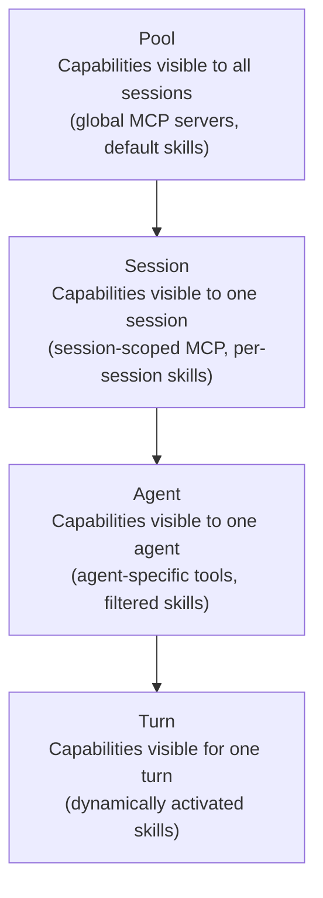

`ExtensionRegistry` resolves visible capabilities by walking the scope chain:

```python
from enum import Enum
from dataclasses import dataclass

class ScopeLevel(Enum):
    """Visibility levels for extension capabilities."""
    POOL = "pool"
    SESSION = "session"
    AGENT = "agent"
    TURN = "turn"

@dataclass(frozen=True, slots=True)
class Scope:
    """A scope identifier that determines which capabilities are visible.
    
    Walk the chain: pool → session → agent → turn.
    Capabilities at each level are visible to all lower levels.
    """
    pool_id: str = "default"
    session_id: str = ""
    agent_name: str = ""
    turn_id: str = ""

class ExtensionRegistry:
    def get_visible_capabilities(
        self,
        scope: Scope,
    ) -> list[AbstractCapability]:
        """Return all capabilities visible at the given scope.
        
        Walks the scope chain: pool → session → agent → turn.
        Capabilities at each level are visible to all lower levels.
        """
        result: list[AbstractCapability] = []
        result.extend(self._pool_caps.values())
        if scope.session_id:
            result.extend(self._session_caps.get(scope.session_id, {}).values())
        if scope.agent_name:
            result.extend(self._agent_caps.get(scope.agent_name, {}).values())
        if scope.turn_id:
            result.extend(self._turn_caps.get(scope.turn_id, {}).values())
        return result

    def get_skill_resources(self, scope: Scope) -> list[SkillResource]:
        """All visible capabilities implementing SkillResource."""
        return [cap for cap in self.get_visible_capabilities(scope)
                if isinstance(cap, SkillResource)]

    def get_mcp_resources(self, scope: Scope) -> list[McpResource]:
        """All visible capabilities implementing McpResource."""
        return [cap for cap in self.get_visible_capabilities(scope)
                if isinstance(cap, McpResource)]

    def get_command_resources(self, scope: Scope) -> list[CommandResource]:
        """All visible capabilities implementing CommandResource."""
        return [cap for cap in self.get_visible_capabilities(scope)
                if isinstance(cap, CommandResource)]
```

This mirrors the existing `McpConfigSnapshot` 4-level partition, generalizing it from MCP-only to all capability types.

### ExtensionRegistry

The registry is the central replacement for fragmented infrastructure:

```python
class ExtensionRegistry:
    """Central registry for all extension capabilities."""

    # Capability storage by scope
    _pool_caps: dict[str, AbstractCapability]
    _session_caps: dict[str, dict[str, AbstractCapability]]
    _agent_caps: dict[str, dict[str, AbstractCapability]]
    _turn_caps: dict[str, dict[str, AbstractCapability]]

    # URI routing
    _uri_routes: dict[str, str]  # scheme → capability_id

    def register(self, cap: AbstractCapability, scope: ScopeLevel,
                 scope_id: str = "", uri_scheme: str = "") -> None:
        """Register a capability at a scope level with optional URI scheme."""
        ...

    def unregister(self, cap_id: str, scope: ScopeLevel,
                   scope_id: str = "") -> None:
        """Remove a capability."""
        ...

    # Query by Resource Protocol type
    def get_skill_resources(self, scope: Scope) -> list[SkillResource]:
        """All visible capabilities implementing SkillResource."""
        return [cap for cap in self.get_visible_capabilities(scope)
                if isinstance(cap, SkillResource)]

    def get_mcp_resources(self, scope: Scope) -> list[McpResource]:
        """All visible capabilities implementing McpResource."""
        return [cap for cap in self.get_visible_capabilities(scope)
                if isinstance(cap, McpResource)]

    def get_command_resources(self, scope: Scope) -> list[CommandResource]:
        """All visible capabilities implementing CommandResource."""
        return [cap for cap in self.get_visible_capabilities(scope)
                if isinstance(cap, CommandResource)]

    # URI resolution (cheap-check-first: skill_exists() before read_skill())
    async def resolve_uri(self, uri: str, scope: Scope) -> str | None:
        """Resolve a URI to content by routing to the appropriate capability.
        
        Uses skill_exists() for cheap URI routing before read_skill() to
        avoid O(n) network calls across all SkillResource capabilities.
        """
        scheme = uri.split("://")[0]
        if scheme == "skill":
            for cap in self.get_skill_resources(scope):
                if await cap.skill_exists(uri):
                    return await cap.read_skill(uri)
        elif scheme == "mcp":
            for cap in self.get_mcp_resources(scope):
                if await cap.resource_exists(uri):
                    return await cap.read_resource(uri)
        return None

    # Change notification
    def get_observable_capabilities(self, scope: Scope) -> list[ChangeObservable]:
        """All visible capabilities implementing ChangeObservable."""
        return [cap for cap in self.get_visible_capabilities(scope)
                if isinstance(cap, ChangeObservable)]

    def merge_change_streams(self, scope: Scope) -> AsyncIterator[ChangeEvent] | None:
        """Merge on_change() streams from all ChangeObservable capabilities.
        
        Replaces AggregatedResourceSource.on_change(). Each capability's
        on_change() stream is consumed concurrently; events are yielded
        in arrival order via an asyncio.Queue.

        This is a sync method (no await needed) — it returns an async generator
        that callers iterate with `async for`.
        """
        observables = self.get_observable_capabilities(scope)
        if not observables:
            return None
        queue: asyncio.Queue[ChangeEvent | None] = asyncio.Queue()

        async def consume(cap: ChangeObservable) -> None:
            try:
                stream = cap.on_change()
                if stream is None:
                    return
                async for event in stream:
                    await queue.put(event)
            except Exception:
                logger.warning("Change stream error in %r", cap, exc_info=True)
            finally:
                await queue.put(None)  # sentinel always pushed

        async def merged() -> AsyncIterator[ChangeEvent]:
            # Tasks created inside the generator to prevent leaks
            # if the iterator is never consumed.
            tasks = [asyncio.create_task(consume(cap)) for cap in observables]
            remaining = len(tasks)
            try:
                while remaining > 0:
                    item = await queue.get()
                    if item is None:
                        # A consume task finished
                        remaining -= 1
                        continue
                    yield item
            finally:
                for t in tasks:
                    t.cancel()

        return merged()
```

### URI Routing

| URI Scheme | Resource Protocol | Client | Example |
|------------|-------------------|--------|---------|
| `skill://` | `SkillResource` | None (local) | `skill://ponytail/SKILL.md` |
| `skill://` | `SkillResource` | MCPClient | `skill://provider/remote-skill` |
| `mcp://` | `McpResource` | MCPClient | `mcp://github/issues` |

The `ExtensionRegistry.resolve_uri()` method routes by scheme to the appropriate Resource Protocol method. The registry iterates visible capabilities implementing the matching Protocol until one returns content.

### Lifecycle Management

#### Creation
Capability objects are created with config + optional client (no I/O). Registered in `ExtensionRegistry`. At this stage, no connection exists and no tool list is available (unless config declares tools statically).

#### Connection (Lazy — triggered at compilation, not first tool call)

**Critical timing**: The MCP connection must be established BEFORE the first tool call, because `AgentFactory.compile()` calls `get_toolset()` → `list_tools()` to discover what tools the MCP server provides. Without a connection, `list_tools()` cannot return the tool list, and the agent's compiled toolset would be empty.

**Non-lazy mode** (default): Connection is established during agent compilation:
1. `AgentFactory.compile()` calls `McpServerCap.get_toolset()`
2. `get_toolset()` calls `list_tools()` → `_ensure_client()`
3. `_ensure_client()` requests `MCPClient` from `SessionConnectionPool`
4. `SessionConnectionPool` returns existing or creates new `MCPClient` (wrapping a `ClientTransport`)
5. `list_tools()` sends MCP `tools/list` through the client
6. Tool list returned, `get_toolset()` builds the pydantic-ai `Toolset`
7. Subsequent `call_tool()` calls reuse the already-established connection

**Lazy mode** (`config.lazy: true`): Connection is deferred to first `call_tool()`:
1. `AgentFactory.compile()` calls `McpServerCap.get_toolset()`
2. `get_toolset()` returns a `ToolsetFunc` that will call `list_tools()` on first invocation (or uses statically-declared tools from config)
3. Tool list comes from config (`tools:` field in YAML), NOT from MCP server — no connection needed
4. First `call_tool()` triggers `_ensure_client()` → connection established
5. This mode is suitable for slow-starting MCP servers where tool list is known at config time

| Mode | Connection trigger | Tool list source | Use case |
|------|-------------------|------------------|----------|
| Non-lazy (default) | `get_toolset()` during compilation | MCP `tools/list` (live) | Standard — tool list always current |
| Lazy (`config.lazy: true`) | First `call_tool()` | Config `tools:` field (static) | Slow-starting MCP servers with known tool list |

#### Connection Pooling
Multiple capabilities pointing to the same MCP server (e.g., one at pool scope, one at session scope) reuse one `MCPClient` from `SessionConnectionPool`. This eliminates the dual-connection problem (P5).

#### Reconnection
No automatic background reconnect. Next access detects stale client (connection closed) and rebuilds. Reuses existing 3-retry exponential backoff from `SkillMcpManager`.

#### Exception Handling
- Aggregation (independent clients): If one child capability fails, others survive. `list_all_tools()` catches per-capability failures, returns partial results with warnings.

#### Shutdown
1. Turn-level capabilities first (reverse activation order)
2. Agent-level capabilities
3. Session-level capabilities
4. Pool-level capabilities last
5. Each capability gets 5-second timeout, then force-cancel
6. `SessionConnectionPool` closes all transports after all capabilities are shut down

#### Concurrent Access
- `asyncio.Lock` per capability for connect/disconnect (double-check pattern)
- Read operations (`list_skills()`, `list_tools()`) are lock-free (use cached data)
- Write operations (`call_tool()`) acquire no lock (client handles concurrency)
- `ExtensionRegistry` uses `asyncio.Lock` on `_turn_caps` dict for concurrent registration/unregistration during active runs. Pool/session/agent-level dicts are mutated only during startup/shutdown, so no lock needed.

#### Hot Reload
- Filesystem watcher (`watchdog`) detects SKILL.md changes → 500ms debounce
- Capability fires `ChangeEvent(kind="resources_changed")` via `on_change()` (requires `ChangeObservable` Protocol)
- `ExtensionRegistry` merges `on_change()` streams from all `ChangeObservable` capabilities, propagating to `AgentFactory._start_hot_swap_listeners()`
- MCP notification mapping: `notifications/tools/list_changed` → `ChangeEvent(kind="tools_changed")`, `notifications/resources/list_changed` → `ChangeEvent(kind="resources_changed")`, `notifications/prompts/list_changed` → `ChangeEvent(kind="prompts_changed")`
- Next agent run re-evaluates `get_toolset()` and `get_instructions()`

### Lifecycle Sequence Diagrams

#### 1. MCP Server Lifecycle (stdio)

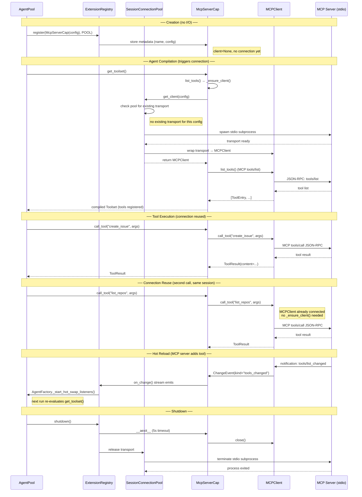

#### 2. Local Skill Lifecycle

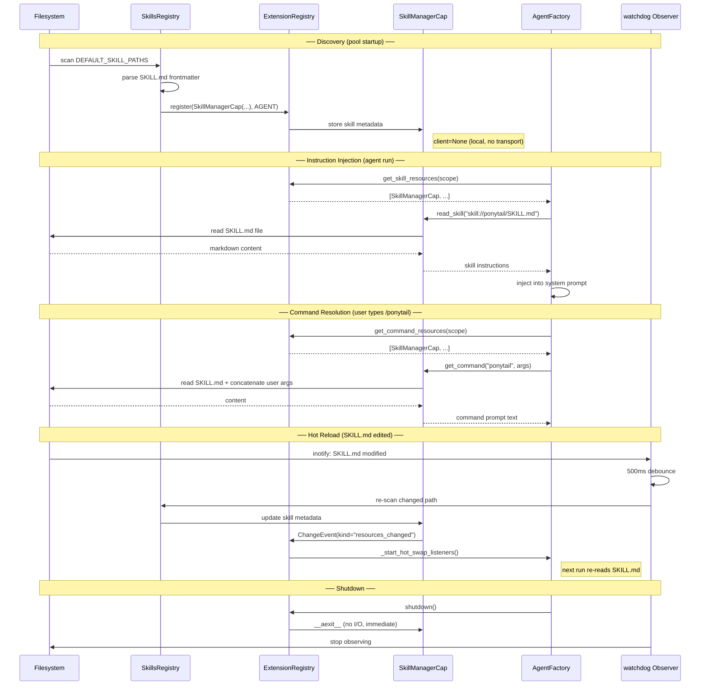

#### 3. Skill with Embedded MCP Server

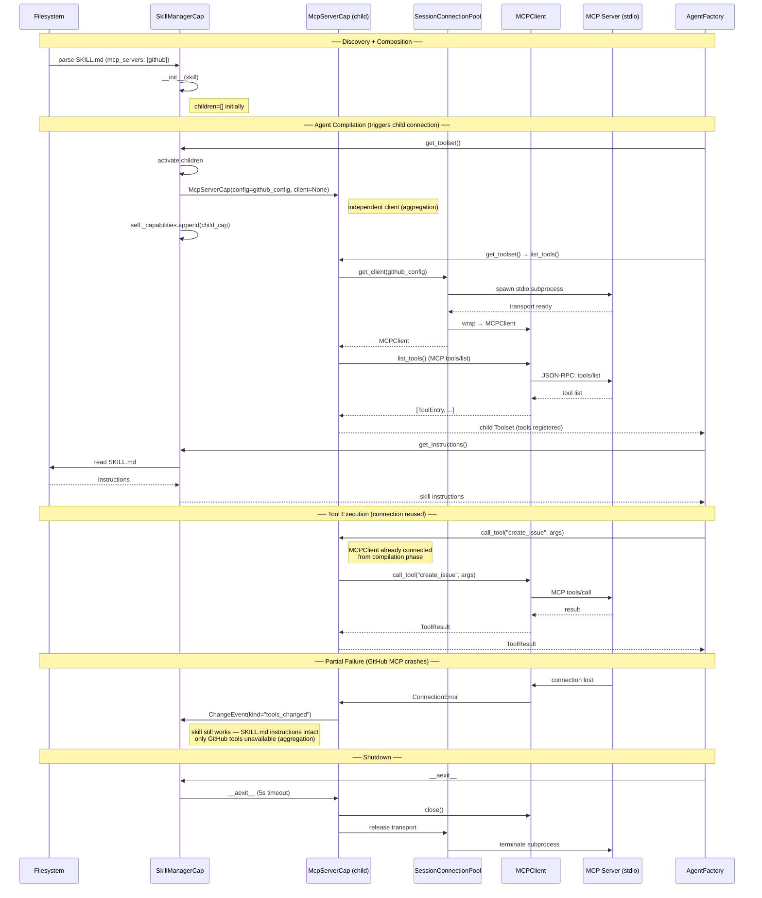

#### 4. MCP-Hosted Skill (skill:// via MCP Resources)

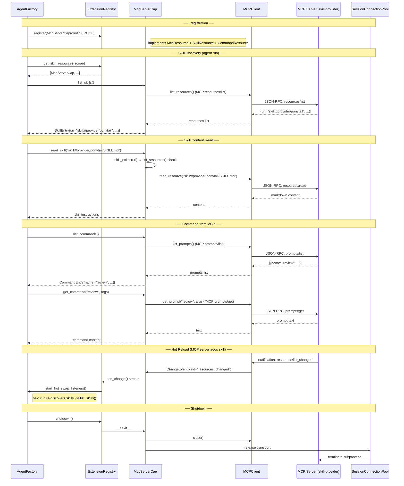

#### 5. Subagent Spawning with MCP Tools

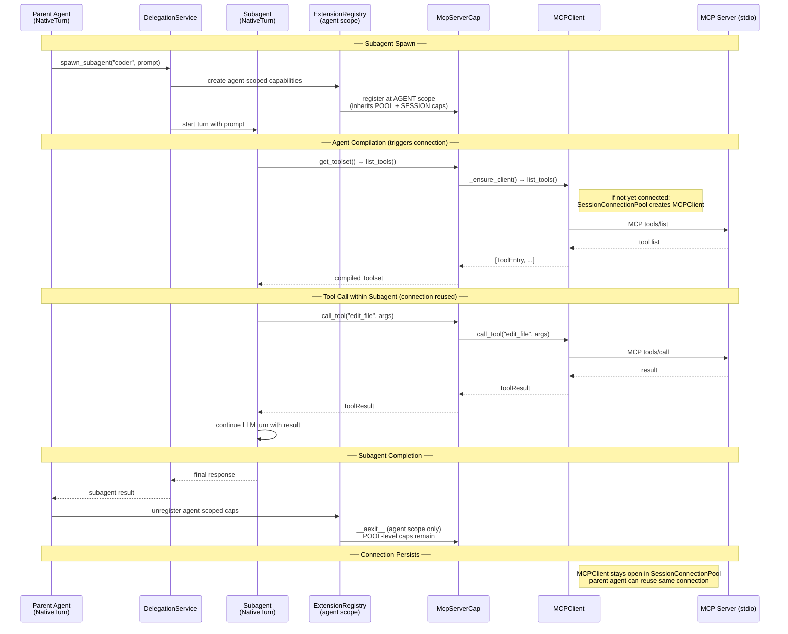

#### 6. MCP Disconnection During Subagent Run

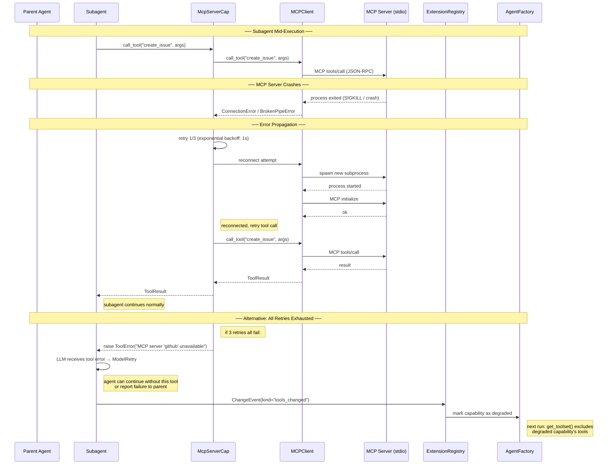

#### 7. Skill-Embedded MCP Failure in Subagent

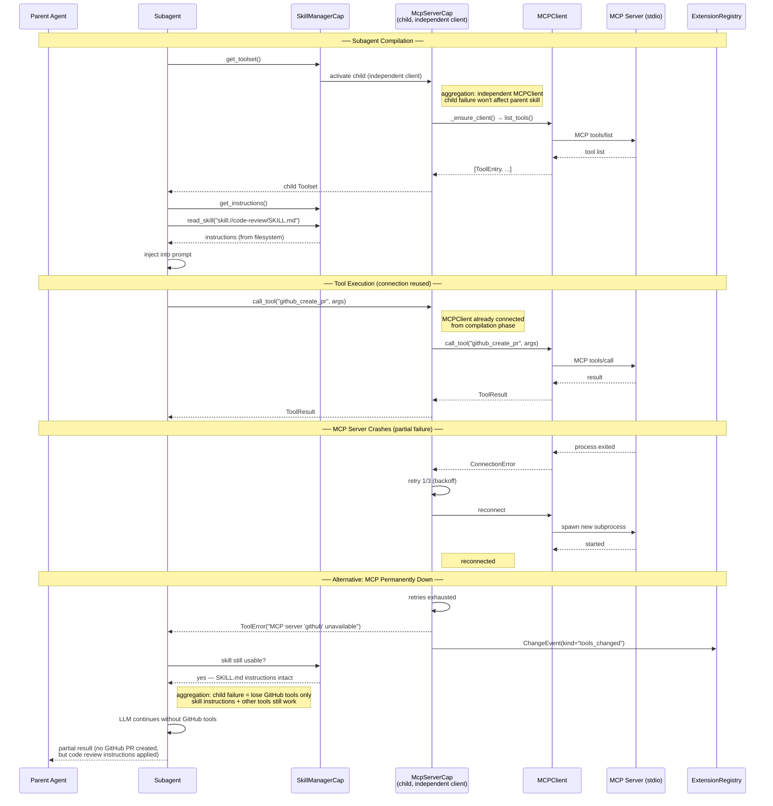

#### 8. Parent Interruption While Subagent Running

```mermaid
sequenceDiagram
    participant User as User / Protocol
    participant Loop as RunLoop<br/>(RunHandle)
    participant Parent as Parent Agent
    participant Sub as Subagent
    participant Cap as McpServerCap
    participant Client as MCPClient
    participant Server as MCP Server

    Note over User,Server: ── Subagent Mid-Execution ──
    Parent->>Sub: spawn_subagent("coder", prompt)
    Sub->>Cap: call_tool("edit_file", args)
    Cap->>Client: call_tool("edit_file", args)
    Client->>Server: MCP tools/call (in progress...)

    Note over User,Server: ── User Sends Interrupt ──
    User->>Loop: cancel / interrupt signal
    Loop->>Sub: CancelScope.cancel()
    Note right of Sub: asyncio.CancelledError raised

    Note over User,Server: ── Cleanup Cascade ──
    Sub->>Cap: __aexit__ (cancelled)
    Cap->>Client: cancel pending tool call
    Client->>Server: MCP cancel request<br/>(or transport close)
    Note right of Server: MCP server may complete<br/>or detect transport close

    Note over User,Server: ── Tool Call State ──
    Note right of Cap: tool call was in-flight<br/>no result returned to subagent<br/>no partial state written

    Note over User,Server: ── Connection State ──
    Loop->>Cap: connection stays in SessionConnectionPool
    Note right of Client: NOT closed — pool owns lifecycle<br/>next turn can reuse connection

    Note over User,Server: ── Parent Resumes ──
    Loop->>Parent: interrupt notification
    Parent-->>User: "subagent interrupted"
    Note right User: user can steer or send new prompt
```

#### 9. Concurrent Subagents Sharing MCP Connection

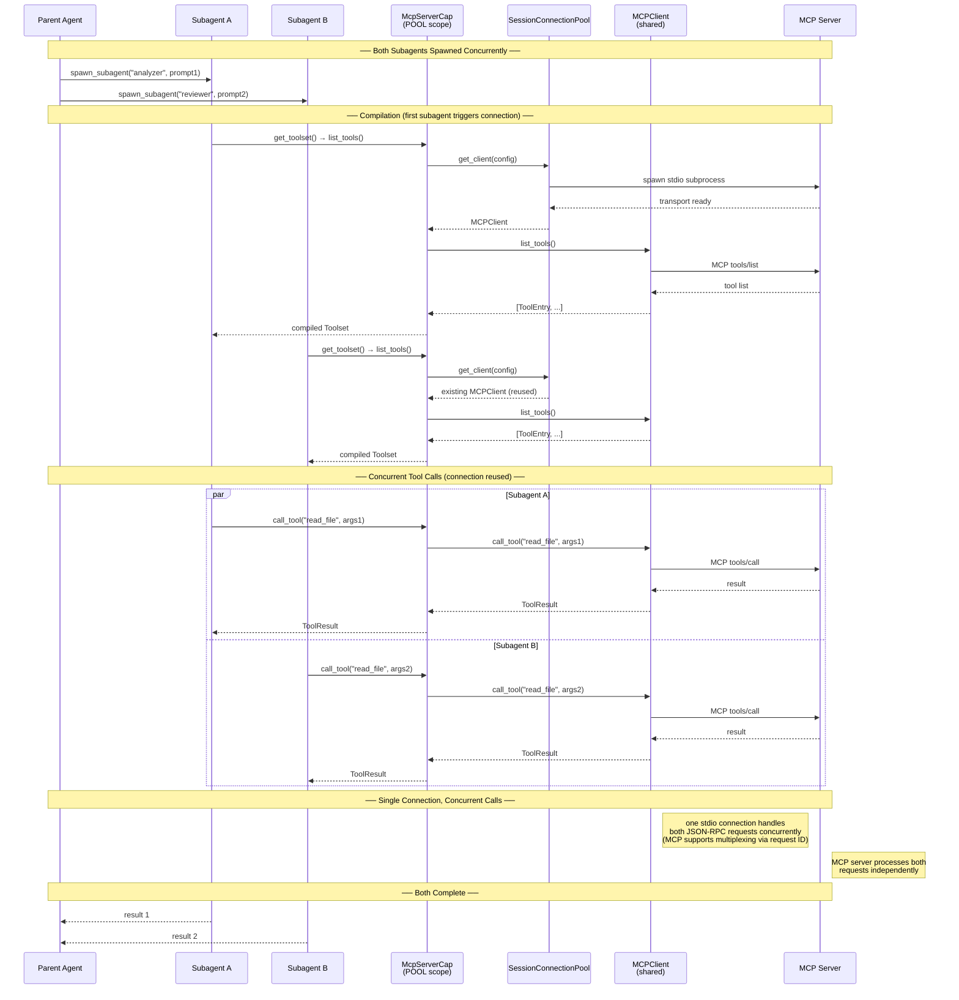

### Cross-Provision Scenarios

#### Scenario 1: MCP provides command + skill
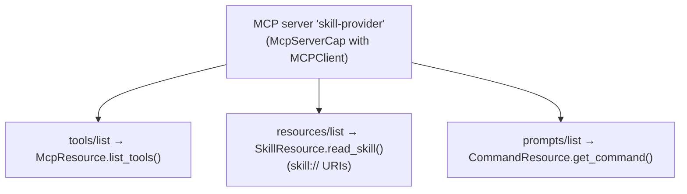
`McpServerCap` implements all 3 Resource Protocols. The registry routes `skill://skill-provider/ponytail` to this capability's `read_skill()`.

#### Scenario 2: Skill declares MCP server
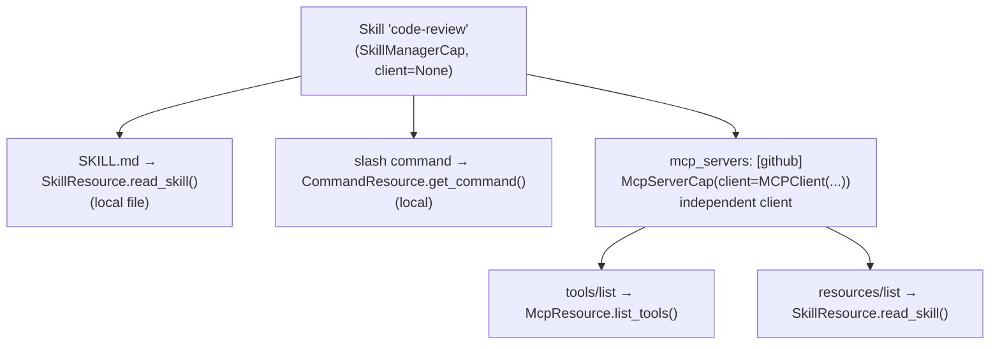
`SkillManagerCap` adds `McpServerCap` as a child with its own independent `MCPClient`. If the GitHub MCP server fails, the skill still works (just without GitHub tools) — aggregation semantics.

### What Gets Deleted

| Component | Replaced By |
|-----------|-------------|
| `SkillMcpManager` | `SkillManagerCap(children=[McpServerCap(...)])` + `SessionConnectionPool` |
| `SkillProvider` Protocol | `SkillResource` Protocol (isinstance check in registry) |
| `SkillURIResolver._providers` dict | `ExtensionRegistry.resolve_uri()` |
| Dual-path in `SkillCapability._build_mcp_toolsets()` | Single path through `SkillManagerCap._capabilities` |
| `AggregatedResourceSource` manual construction | `ExtensionRegistry.get_visible_capabilities()` |
| `AggregatedResourceSource.on_change()` merge | `ExtensionRegistry` merges `ChangeObservable.on_change()` streams |
| `ResourceSource` generic Protocol | Domain-specific Protocols (`SkillResource`, `McpResource`, `CommandResource`, `ChangeObservable`) |
| `SkillCapability` | `SkillManagerCap` (per-agent, not per-skill) |
| `SkillActivationCapability` | `SkillManagerCap.before_model_request()` |
| `LocalSkillCap` | `SkillManagerCap` (merged) |
| `SkillsInstructionConfig.mode` | Dead code — `SkillManagerCap.get_instructions()` always returns metadata |
| `SkillCommand` | `CommandEntry` (from `SkillManagerCap.list_commands()`) |

### Migration: `AgentContext.resources`

The existing `AgentContext.resources: ResourceSource | None` field is used by code that calls `ctx.resources.list()` or `ctx.resources.read(uri)`. Since `ResourceSource` is being replaced, this field needs a migration path:

**Phase 1-3 (transition)**: Provide a `ResourceSourceAdapter` that wraps `ExtensionRegistry` and exposes the old `ResourceSource` interface:

```python
class ResourceSourceAdapter(ResourceSource):
    """Backward-compatible adapter wrapping ExtensionRegistry."""

    def __init__(self, registry: ExtensionRegistry, scope: Scope):
        self._registry = registry
        self._scope = scope

    async def list(self) -> Sequence[ResourceEntry]:
        # Merge list_skills() from all SkillResource capabilities
        entries = []
        for cap in self._registry.get_skill_resources(self._scope):
            entries.extend(await cap.list_skills())
        return entries

    async def read(self, uri: str) -> str | None:
        return await self._registry.resolve_uri(uri, self._scope)

    async def exists(self, uri: str) -> bool:
        for cap in self._registry.get_skill_resources(self._scope):
            if await cap.skill_exists(uri):
                return True
        return False

    def on_change(self) -> AsyncIterator[ChangeEvent] | None:
        """Merge on_change() streams from all ChangeObservable capabilities."""
        return self._registry.merge_change_streams(self._scope)
```

**Phase 4 (final)**: `AgentContext.resources` is replaced by `AgentContext.extension_registry: ExtensionRegistry | None`. Callers use `registry.resolve_uri(uri, scope)` and `registry.get_skill_resources(scope)` directly. The adapter is removed.

### What Stays

| Component | Reason |
|-----------|--------|
| `AbstractCapability` | pydantic-ai's interface — unchanged |
| `SessionConnectionPool` | Extended with `get_client(config) -> MCPClient`. Still manages `ClientTransport` reuse; new method wraps transport in `MCPClient` |
| `MCPClient` | MCP protocol implementation — injected into capabilities |
| `ChangeEvent` | Capability-layer events — extended with `prompts_changed` kind |
| `SkillsRegistry` | Filesystem discovery — wrapped by `SkillManagerCap._local_skills` |

---

## Security Considerations

### URI Injection
The `ExtensionRegistry.resolve_uri()` must validate URI schemes against registered routes. Unregistered schemes must be rejected with a clear error. Path traversal protection (already in `SkillURIResolver` via `Path.relative_to()`) must be preserved in `SkillManagerCap`.

### Client Security
MCP stdio clients execute subprocess commands. Existing `BaseMCPServerConfig` validation (command allowlist, argument sanitization) must be preserved in `McpServerCap`.

### Scope Escalation
Capabilities registered at a lower scope (e.g., turn) must not be visible at a higher scope (e.g., pool). The `ExtensionRegistry.get_visible_capabilities()` walks from pool → turn, never the reverse. A turn-level capability cannot escape its scope.

### Composition Depth
Deep nesting (skill → MCP → MCP → ...) could be used to obscure malicious capabilities. The depth limit of 3 with warnings beyond prevents this.

### Resource Exhaustion
Each `MCPClient` may hold a subprocess or network connection. The `SessionConnectionPool` must enforce a maximum concurrent clients limit (configurable, default 20). Excess capabilities share clients or queue.

---

## Implementation Plan

### Phase 1: MCP Capability Extraction (Medium, ~500 LOC)

**Goal**: Extract `MCPCapability` into `McpServerCap` with `MCPClient` injection.

**Changes**:
1. Create Resource Protocol interfaces (`SkillResource`, `McpResource`, `CommandResource`, `ChangeObservable`)
2. Create `McpServerCap` implementing `McpResource` + `SkillResource` + `CommandResource` + `ChangeObservable`, receiving `MCPClient` via constructor
3. Replace `MCPCapability` with `McpServerCap` in `AgentFactory.compile()`
4. Add `get_client(config) -> MCPClient` method to `SessionConnectionPool` (wraps existing `ClientTransport` management)
5. Create `ResourceSourceAdapter` wrapping `ExtensionRegistry` for backward-compatible `AgentContext.resources` access

**Solves**: P1 (MCP capabilities queryable via Resource Protocols), P5 (unified connection path for MCP)

**Verification**: Existing MCP tests pass. `isinstance(cap, McpResource)` returns `True` for MCP capabilities.

**Dependencies**: None (can start immediately)

**Rollback**: Keep `MCPCapability` as deprecated alias. Revert `AgentFactory` to use old class.

### Phase 2: Skill Capability Extraction (Medium, ~600 LOC)

**Goal**: Merge `SkillCapability` + `SkillActivationCapability` into `SkillManagerCap` with child `McpServerCap` composition.

**Changes**:
1. Create `SkillManagerCap` extending `CombinedToolsetCapability`, implementing `SkillResource` + `CommandResource` + `ChangeObservable`
2. Move `SkillMcpManager` logic into `SkillManagerCap` child management (inherited from `CombinedToolsetCapability`)
3. Replace `SkillCapability` with `SkillManagerCap`
4. Merge `SkillActivationCapability`'s `before_model_request` into `SkillManagerCap`
5. Delete `SkillCapability`, `SkillActivationCapability`, `LocalSkillCap`, `SkillsInstructionConfig.mode`
6. Wire child `McpServerCap` instances to `SessionConnectionPool` for client management

**Solves**: P1 complete (skills queryable via Resource Protocols), P5 complete (no more dual path)

**Verification**: Existing skill tests pass. Skill content queryable via `isinstance(cap, SkillResource)`.

**Dependencies**: Phase 1 (uses `McpServerCap` for child capabilities)

**Rollback**: Keep `SkillCapability` as deprecated alias.

### Phase 3: MCP Commands and Cross-Provision (Small, ~300 LOC)

**Goal**: `McpServerCap` implements `CommandResource` and `SkillResource` for MCP-hosted skills. Cross-provision scenarios work.

**Changes**:
1. Add `CommandResource` to `McpServerCap` (maps MCP prompts/list → commands)
2. Add `SkillResource` to `McpServerCap` (maps MCP resources/list → skill:// URIs)
3. Replace `SkillProvider` Protocol with `SkillResource` isinstance check
4. Update `_rebuild_skill_capabilities()` to iterate `ExtensionRegistry` instead of local `SkillsRegistry` only
5. Wire MCP notification mapping (`tools/list_changed` → `ChangeEvent`, etc.) in `McpServerCap.on_change()`

**Solves**: P2 (MCP capabilities as SkillResource), P3 (MCP skills get capabilities), P4 partial (change notification wiring at capability level; full propagation requires Phase 4 registry)

**Verification**: MCP-hosted skills visible in `skill://` URI resolution. Slash commands from MCP update on `tools/list_changed`.

**Dependencies**: Phase 2

**Rollback**: Revert `CommandResource` addition. Old `SkillProvider` Protocol restored.

### Phase 4: ExtensionRegistry and Scoping (Large, ~600 LOC)

**Goal**: `ExtensionRegistry` replaces fragmented infrastructure. Session-level scoping added.

**Changes**:
1. Create `ExtensionRegistry` with 4-level scope storage and `asyncio.Lock` on `_turn_caps`
2. Migrate `SkillURIResolver._providers` to `ExtensionRegistry.resolve_uri()`
3. Migrate `AggregatedResourceSource` construction to `ExtensionRegistry.get_visible_capabilities()`
4. Merge `AggregatedResourceSource.on_change()` into `ExtensionRegistry` (merge `ChangeObservable` streams)
5. Add session-level scoping (`_session_caps` in registry)
6. Add filesystem watcher (`watchdog`) for skill hot-reload
7. Wire `ChangeEvent` propagation through registry to `AgentFactory._start_hot_swap_listeners()`
8. Delete `SkillCommand`, `SkillCommandRegistry`
9. Replace `SkillCommand` with `CommandEntry` from `SkillManagerCap.list_commands()`
10. Replace `AgentContext.resources` with `AgentContext.extension_registry` (remove `ResourceSourceAdapter`)

**Solves**: P4 complete (change notification chain through registry), P6 (session-level scoping), P7 (filesystem watcher)

**Verification**: Sessions have isolated skill sets. New skills discovered without restart. MCP tool changes trigger skill re-evaluation.

**Dependencies**: Phases 1-3

**Rollback**: Revert to `AggregatedResourceSource` + `SkillURIResolver`. Session scoping becomes no-op.

### Dependency Matrix


Each phase delivers value independently. Phases can ship in separate releases.

---

## Open Questions

### Q1 (RESOLVED): Should `ExtensionRegistry` be on `AgentPool` or `HostContext`?

Split: pool-level capabilities on `AgentPool`/`AgentHost`, session+ on `HostContext`. Pool-level capabilities are registered at startup. Session/agent/turn capabilities are managed per-scope.

### Q2 (RESOLVED): `CommandResource.get_command()` is async

MCP prompts/get is async (network call). Local slash commands are sync (string formatting). `get_command()` is `async` for all capabilities — local capabilities return immediately. This is already reflected in the Protocol interface. No `SyncCommandResource` variant needed.

### Q3 (RESOLVED): How does `SkillActivationCapability` (per-turn injection) interact with `ExtensionRegistry` turn-level scope?

`SkillCapability` + `SkillActivationCapability` are merged into `SkillManagerCap`. `SkillManagerCap` manages instructions via `before_model_request` (dynamic injection). `ExtensionRegistry` manages capabilities at scope levels. These are orthogonal: the registry handles WHERE capabilities are visible, `SkillManagerCap` handles WHAT instructions are injected per-turn.

### Q4 (RESOLVED): Should `AcpAgentCap` implement `McpResource` directly, or delegate to child `McpServerCap`?

`AcpAgentCap` is dropped from this RFC. ACP agents are delegation targets, not tool providers. ACP has no native `tools/list`, `resources/list`, or `prompts/list`. MCP-over-ACP is unstable and can be added as a future RFC when the feature stabilizes. ACP delegation stays as-is via existing `SubagentCapability`.

### Q5 (RESOLVED): `SkillCommandRegistry` will be deleted

`SkillCommandRegistry` is replaced by `ExtensionRegistry.get_command_resources(scope)`. The registry queries capabilities by `isinstance(cap, CommandResource)`, which covers both local skills and MCP-hosted commands. `SkillCommandRegistry` will be deleted in Phase 4. A thin adapter may be provided during Phase 2-3 for backward compatibility.

### Q6 (RESOLVED): How should config-level capability declarations work in YAML?

Keep existing YAML sections (`mcp_servers:`, `skills:`). The registry handles construction. No unified `capabilities:` section — existing sections are preserved.

### Q7 (RESOLVED): Should `SkillManagerCap` support lazy skill content loading?

Keep lazy loading. `SkillManagerCap` holds `Skill` objects whose `instructions` field is already lazy (loaded on first access). `read_skill()` delegates to `skill.instructions` which handles lazy loading internally.

### Q8 (RESOLVED): How does `FilteredToolsetCapability` interact with the new architecture?

Filtering happens in `SkillManagerCap.get_toolset()` layer. `CombinedToolsetCapability` already merges child toolsets. `SkillManagerCap` applies `allowed_tools` filtering after collecting tools from children, preserving existing `SkillCapability` behavior.

### Q9 (RESOLVED): How do ACP commands map to `CommandResource`?

ACP has no native `prompts/list`. `AcpAgentCap` is dropped entirely. When MCP-over-ACP stabilizes, a future RFC can add ACP support with `CommandResource` returning empty lists for ACP agents without MCP-over-ACP.

---

## Decision Record

**Status**: DRAFT — awaiting review.

No decision has been made yet. This RFC is open for stakeholder feedback.

### Revision History

| Revision | Date | Changes |
|----------|------|---------|
| 1 | 2026-07-10 | Initial draft with 4 orthogonal dimensions (Protocol × Transport × Composition × Scope) |
| 2 | 2026-07-11 | Simplified to 3 concepts (Resource Protocols + Client DI + Scope). Removed Transport dimension — protocol clients ARE the transport. Replaced generic Protocol interfaces with domain-specific ones. Replaced Source types with Capability types. Simplified composition to client sharing pattern. |
| 3 | 2026-07-11 | Oracle review fixes: Added `ChangeObservable` Protocol for `on_change()` (C1). Clarified `SessionConnectionPool` manages `ClientTransport` not `MCPClient`, added `get_client()` extension (C2). Added `ResourceSourceAdapter` migration path for `AgentContext.resources` (C3). Replaced `add_child()` private field access with `add_tunneled_child(config)` factory method (C4). Added `skill_exists()` to `SkillResource` for URI routing (C5). Added `list_resources()` to `McpResource` (M1). Fixed `CommandEntry.arguments` mutable default to `tuple` (M2). Clarified depth limit counting and configurability (M3). Added tunneling shutdown ordering rule (M4). Split P4 resolution across Phase 3 (capability-level) and Phase 4 (registry-level) (M5). Added `asyncio.Lock` for `_turn_caps` concurrency (M6). Moved cycle detection to registration time (M7). Fixed `ToolResult.content` to `str | bytes` (m1). Added `prompts_changed` to `ChangeEvent` mapping (m5). Resolved Q2 (async) and Q5 (delete `SkillCommandRegistry`). Added Q8 (`FilteredToolsetCapability` interaction) and Q9 (ACP commands). |
| 4 | 2026-07-11 | Oracle review round 2: Fixed C5 regression — `resolve_uri()` now uses `skill_exists()`/`resource_exists()` for cheap-check-first routing. Fixed N1 — `McpServerCap.__init__` accepts `session_pool` parameter. Fixed N2 — aggregation example uses `session_pool=pool` instead of direct `MCPClient(...)`. Fixed N3 — `ResourceSourceAdapter.on_change()` implemented. Fixed N4 — added `get_observable_capabilities()` and `merge_change_streams()` to `ExtensionRegistry`. Added `resource_exists()` to `McpResource` Protocol. |
| 5 | 2026-07-11 | Oracle review round 3: Unified `McpServerCap` constructor between DI and Concrete Types sections (N1). Changed `merge_change_streams` from `async def` to `def` (N5). Replaced dead `active` counter with sentinel-based completion pattern (N6). Moved task creation inside `merged()` generator to prevent leaks (N7). Removed 100ms polling timeout. |
| 6 | 2026-07-11 | Oracle review round 4: Fixed sentinel bug — `consume()` now wraps entire body in `try/finally` so sentinel is always pushed even when `on_change()` returns `None` or raises. Added rev 4-5 entries to revision history table. |
| 7 | 2026-07-11 | Oracle verification: Aligned `ChangeEvent` with codebase (retained `capability_name`, added `source_uri`, documented `kind` widening). Defined `Scope` and `ScopeLevel` types. Removed `acp://` from architecture diagram (not in routing table). Added exception logging in `consume()`. Added protocol method sketches for `LocalSkillCap` and `AcpAgentCap`. Added implementation sketch for `get_visible_capabilities()`. Removed redundant dashed arrow in dependency matrix. |
| 8 | 2026-07-11 | Oracle final verification: Added missing `McpResource` method implementations to `AcpAgentCap` (`list_resources()`, `read_resource()`, `resource_exists()`). All 5 McpResource methods now have implementation sketches. |
| 9 | 2026-07-11 | Added 5 lifecycle sequence diagrams: MCP server lifecycle (stdio), local skill lifecycle (discovery → injection → hot reload), skill with embedded MCP (aggregation + partial failure), ACP-tunneled MCP (tunneling + parent death → child invalidation), MCP-hosted skill (skill:// via MCP resources). |
| 10 | 2026-07-11 | Added 6 subagent + error scenario sequence diagrams: subagent spawning with MCP tools, MCP disconnection during subagent run (retry + degraded mode), ACP disconnection during subagent run (cascade invalidation + reconnection), skill-embedded MCP failure in subagent (aggregation partial failure), parent interruption while subagent running (cancel cascade), concurrent subagents sharing MCP connection (multiplexed JSON-RPC). |
| 11 | 2026-07-11 | Dropped AcpAgentCap entirely — ACP agents are delegation targets, not tool providers. Replaced LocalSkillCap with SkillManagerCap (extends CombinedToolsetCapability, merges SkillCapability + SkillActivationCapability). Resolved all open questions Q1, Q3-Q9. Removed ACP sequence diagrams (4, 8). Updated cross-provision scenarios, composition, security, lifecycle. Updated What Gets Deleted/Stays tables. |
| 12 | 2026-07-11 | Fixed lazy initialization timing: connection happens at `get_toolset()`/`list_tools()` during agent compilation, NOT at first `call_tool()`. Added lazy vs non-lazy mode documentation with comparison table. Updated sequence diagrams 1, 3, 5, 7, 9 to include compilation phase before tool execution. Removed redundant `get_client()` calls from concurrent tool call diagrams (connection already established during compilation). |

### Key Discussion Points Anticipated

1. **Option A vs Option B**: Is the migration cost of Option B justified, or should we start with Option A and migrate later?
2. **Resource Protocol granularity**: Are `SkillResource` / `McpResource` / `CommandResource` the right split, or should there be more/fewer protocols?
3. **Phase ordering**: Should Phase 3 (cross-provision) come before Phase 4 (registry), or are they parallelizable?
4. **SkillManagerCap design**: Is `CombinedToolsetCapability` the right base class?
5. **ACP future**: When should MCP-over-ACP be revisited?
6. **Deletion list**: Are there components we're not ready to delete yet?

---

## References

### Internal
- [RFC-0050: AgentWolf v1.0 Foundation Architecture](../draft/RFC-0050-agentwolf-v1-foundation-architecture.md) — six orthogonal layers
- [RFC-0042: Unified Lifecycle Architecture](../draft/RFC-0042-unified-lifecycle-architecture.md) — six pluggable dimensions
- [RFC-0020: MCP Skills Resources Provider Protocol](../implemented/RFC-0020-mcp-skills-resources-provider.md) — skill:// URI scheme
- [RFC-0016: Skill Slash Commands](../draft/RFC-0016-skill-slash-commands.md) — command/skill mapping
- [RFC-0033: MCP-over-ACP Transport](../implemented/RFC-0033-mcp-over-acp-transport.md) — ACP tunneling pattern (reuse ACP client as transport)
- `openspec/changes/m3-5-backdoor-cleanup/` — agent_pool backdoor removal (prerequisite)
- `docs/superpowers/specs/2026-07-10-agent-pool-backdoor-cleanup-design.md` — backdoor cleanup design

### External
- [MCP Specification](https://modelcontextprotocol.io/) — tools, resources, prompts primitives
- [SEP-2640: MCP Skills Provider](https://github.com/modelcontextprotocol/specification/discussions) — skill:// via MCP resources
- [VS Code Contribution Points](https://code.visualstudio.com/api/contribution-points) — unified extension model reference
- [Open Plugin Spec (Vercel)](https://openplugin.spec/) — skills + MCP as core component types
- [Agent Skills Spec](https://github.com/agentskills/agentskills) — SKILL.md format

### Research Artifacts
- 8 parallel research agents investigated AI frameworks (Claude Code, Cursor, LangChain, AutoGen/CrewAI), MCP specs, software extension patterns (VS Code, Eclipse, IntelliJ, Blender, Django, Flask, Rust, DI), oh-my-openagent, OpenCode, DeerFlow, LangChain, and LangGraph
- Oracle review identified 6 key findings including TransportHandle (now removed), Scope dimension, and SessionConnectionPool reuse
- Cross-framework comparison: all 8 frameworks lack unified extension abstraction; AgentPool's RFC-0051 is ahead in unification
