# RFC-0053: Pre-M4 Protocol Server Debt Cleanup

## Overview

This RFC proposes a phased cleanup of 51 technical debt items identified across the ACP server, OpenCode server, and shared orchestration infrastructure on the `refactor/agentwolf_v1` branch. The cleanup establishes the architectural baseline required before M4 (multi-config) can begin. M1–M3.5 refactoring is complete — `HostContext` replaces `AgentPool` access, lifecycle dimensions decouple the RunLoop, and the `ResourceProvider` hierarchy is replaced by native pydantic-ai `AbstractCapability`. However, the protocol server layer accumulated dual execution paths, type safety erosion, encapsulation violations, and identity coupling that will compound under M4's multi-config model.

## Table of Contents

- [Background & Context](#background--context)
- [Problem Statement](#problem-statement)
- [Goals & Non-Goals](#goals--non-goals)
- [Evaluation Criteria](#evaluation-criteria)
- [Options Analysis](#options-analysis)
- [Recommendation](#recommendation)
- [Technical Design](#technical-design)
- [Implementation Plan](#implementation-plan)
- [Open Questions](#open-questions)
- [Decision Record](#decision-record)
- [References](#references)

---

## Background & Context

### Current State

The `refactor/agentwolf_v1` branch (PR #144) contains 75 commits across M1–M3.5 refactoring milestones. The branch is OPEN and MERGEABLE with CI green. Key completions:

- `.agent_pool` references in source: 0 (backdoor eliminated)
- `ResourceProvider` hierarchy: deleted, replaced by `AbstractCapability`
- `ProtocolEventConsumerMixin`: adopted by all 4 event-streaming servers (ACP, OpenCode, AG-UI, OpenAI API)
- `EventBus`: clean (no `receive()`/`get()` issues)
- 4,385 tests collected, CI passing

### Historical Context

The debt accumulated during rapid M1–M3 iteration where architectural foundations were replaced while protocol servers continued to use the old patterns. Three parallel explore agents systematically catalogued the debt:

| Domain | Blocking | Severe | Moderate | Nice-to-have | Total |
|--------|----------|--------|----------|--------------|-------|
| ACP Server | 6 | 0 | 0 | 12 | 18 |
| OpenCode Server | 0 | 8 | 6 | 5 | 19 |
| Shared Infrastructure | 0 | 0 | 14 | 0 | 14 |
| **Total** | **6** | **8** | **20** | **17** | **51** |

### Glossary

| Term | Definition |
|------|------------|
| `HostContext` | Immutable dataclass providing access to MCP manager, storage, registry without exposing the full mutable `AgentPool` |
| `RunHandle` | The RunLoop implementation; modified in-place with dimension injection (TriggerSource, Journal, SnapshotStore, CommChannel, EventTransport) |
| `Turn.execute()` | Unified turn execution path via `HookAwareTurn`; the target single path for all agent types |
| `_run_stream_once()` | Legacy standalone execution path in `BaseAgent`; fires hooks inline for non-native agents |
| `hooks_fired` | `set[str]` on `AgentRunContext` preventing double hook firing when both paths execute |
| `CommChannel` | Protocol abstracting event delivery + feedback reception; owns the Journal |
| `RunScope` | Proposed cross-cutting routing context (config_id, tenant_id, session_id, user_id) for M4 |
| `ProtocolEventConsumerMixin` | Reusable event consumer lifecycle for protocol servers |

---

## Problem Statement

### The Problem

Four categories of technical debt block or complicate M4:

**1. Dual Execution Paths** — ACP agents have two code paths held together by a `hooks_fired` double-fire guard (21 refs across 4 files). `ACPTurn.execute()` is dead code because `ACPAgentAPI` is missing `stream_events()` and `get_messages()` methods. ACP standalone falls back to a 200-LOC inline `_stream_events()` implementation.

**2. Encapsulation Violations** — OpenCode routes access private attributes (`_all_capabilities`, `_sessions`, `_servers`) in 6 files. 68 `state.pool.*` accesses bypass `HostContext`. ACP server mutates `NativeAgent._mcp_snapshot` externally.

**3. Type Safety Erosion** — 8 `# type: ignore[attr-defined]` in `run.py` alone. `deliver_feedback` is duck-typed via `try/except AttributeError`. `_channel_publishes_to_event_bus` uses fragile `isinstance` check. `hasattr`/`getattr` patterns in ACP code.

**4. Identity Coupling** — OpenCode server hardcodes `state.agent.name` as session identity (5 files) and `config_file_path` as pool identity (3 files). `session_controller` hardcodes `self.pool.manifest.agents` (4 sites). Under M4's multi-config model, these assumptions break.

### Evidence

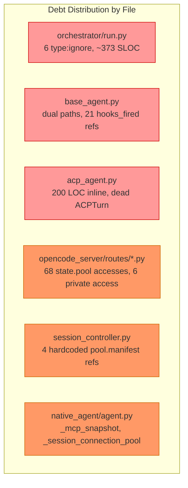

- `grep -rn 'hooks_fired' src/` → 21 results across 4 files
- `grep -rn '# type: ignore' src/agentpool/orchestrator/run.py` → 8 results
- `grep -rn 'state\.pool\.' src/agentpool_server/opencode_server/` → 68 results
- `grep -rn '_mcp_snapshot\|_session_connection_pool' src/` → results in agent.py + session.py
- `RunHandle.start()` → ~373 SLOC with `# noqa: PLR0915`

### Impact of Inaction

- **Cost**: M4 implementation must thread `RunScope` through both execution paths, doubling routing surface area. Identity coupling requires touching every OpenCode route during M4 rather than now.
- **Risk**: Type safety erosion compounds — each new `# type: ignore` makes the next one easier to add. Dual paths make hook behavior harder to debug under multi-config.
- **Opportunity**: M4's `ConfigRegistry`/`HostRegistry` requires a clean single-entry-point architecture. Fixing debt during M4 means debugging both layers simultaneously.

---

## Goals & Non-Goals

### Goals (In Scope)

1. Unify ACP execution through `Turn.execute()` as the sole path; remove `hooks_fired` guard (21 refs → 0)
2. Remove 6 `# type: ignore[attr-defined]` in `run.py` by typing `CommChannel` protocol completely
3. Remove `_mcp_snapshot`/`_session_connection_pool` from `NativeAgent`; consolidate on `MCPManager`
4. Remove legacy `RunStatus` enum; add `RunOutcome` to preserve terminal state distinction
5. Wire `McpToolsChangedEvent` and distinguish `StreamCompleteEvent(cancelled=True)` in `EventProcessor`
6. Refactor `RunHandle.start()` (~373 SLOC) into 5 sub-methods each < 100 SLOC
7. Add `deliver_feedback`, `publishes_to_event_bus`, `set_replaying` to `CommChannel` protocol

### Non-Goals (Out of Scope — Merged into M4)

1. Migrate 68 `state.pool.*` accesses to `state.host_context.*` in OpenCode server → M4 task group 18
2. Introduce `RunScope` dataclass with default values → M4 task groups 7-8
3. Add public API methods for private attribute access in OpenCode routes → M4 task group 18
4. Handle `RunStartedEvent` in `EventProcessor` → M4 task 18.3
5. Remove single-config hardcoding in `session_controller` → M4 task 18.9

### Non-Goals (Out of Scope — Deferred)

6. AgentWolf rename (`agentpool` → `agentwolf`) — deferred to final phase
7. M4 implementation itself (ConfigRegistry, HostRegistry, RunScope routing)
8. ACP protocol version switch or proxy chain refactor
9. `session_pool_integration.py` file split (1,453 LOC) — optional, can defer
10. `_agent_pool` constructor threading removal (25+ refs) — deferred to rename

### Success Criteria

- [ ] `grep -rn 'hooks_fired' src/` returns 0
- [ ] `grep -rn 'type: ignore\[attr-defined\]' src/agentpool/orchestrator/run.py` returns 0
- [ ] `grep -rn '_mcp_snapshot\|_session_connection_pool' src/` returns 0
- [ ] `grep -rn 'RunStatus' src/` returns 0
- [ ] `grep -rn 'host_context.pool' src/` returns 0
- [ ] `grep -rn '_replaying' src/agentpool/orchestrator/run.py` returns 0
- [ ] `uv run pytest` — all tests pass
- [ ] `uv run ruff check src/` — no new lint errors
- [ ] `uv run --no-group docs mypy src/` — no new type errors
- [ ] ACP standalone streaming snapshot test passes (same events + metadata enrichment as before)

---

## Evaluation Criteria

| Criterion | Weight | Description | Minimum Threshold |
|-----------|--------|-------------|-------------------|
| M4 Readiness | High | Eliminates all debt items that would block or complicate M4 implementation | All 6 blocking + 8 severe items resolved |
| Type Safety | High | Removes `# type: ignore`, `hasattr`, `getattr`, `try/except AttributeError` patterns | 0 `# type: ignore` in `run.py` |
| Architectural Cleanliness | High | Eliminates dual paths, legacy enums, encapsulation violations | Single execution path for all agent types |
| Implementation Speed | Medium | Time from start to M4-ready baseline | ≤ 30 task-days |
| Risk of Regression | Medium | Likelihood of breaking existing functionality | All 4,385 tests pass; snapshot test green |
| Merge Conflict Risk | Low | Likelihood of conflicts with `develop/agentic` | Minimized by scoping to server/orchestrator layer |

---

## Options Analysis

### Option 1: Full Cleanup Before M4 (Phases 1–6)

**Description**

Execute all 6 phases (43 tasks) covering ACP path unification, legacy field cleanup, OpenCode hardening, type safety, M4 identity preparation, and event system gaps. Phase 7 (14 nice-to-have items) remains optional.

**Advantages**

- Establishes clean architectural baseline; M4 builds on solid foundation
- All 51 debt items addressed in a single focused effort
- Codebase context is fresh from M1–M3 work; lower cognitive cost than returning later
- Verification gates provide clear M4 readiness signal
- `RunScope` abstraction in Phase 5 makes M4's routing a configuration change, not a code change

**Disadvantages**

- Extended PR #144 lifecycle (~30 task-days)
- Potential merge conflicts with `develop/agentic` during the extended period
- Large changeset increases review burden
- `ACPTurn.execute()` is dead code — making it live may surface latent bugs

**Evaluation Against Criteria**

| Criterion | Rating | Notes |
|-----------|--------|-------|
| M4 Readiness | ★★★★★ | All 6 blocking + 8 severe + 14 shared items resolved |
| Type Safety | ★★★★★ | 0 `type: ignore` in `run.py`; CommChannel fully typed |
| Architectural Cleanliness | ★★★★★ | Single execution path; no legacy enums; no encapsulation violations |
| Implementation Speed | ★★★☆☆ | ~30 task-days; 6 phases |
| Risk of Regression | ★★★☆☆ | Large changeset; ACP path change is behavioral |
| Merge Conflict Risk | ★★☆☆☆ | Extended PR lifecycle increases exposure |

**Effort Estimate**

- Complexity: High
- Resources: 1 developer, ~30 task-days
- Dependencies: None (codebase is stable, CI green)

**Risk Assessment**

| Risk | Likelihood | Impact | Mitigation |
|------|------------|--------|------------|
| ACP path unification surfaces latent bugs | Medium | High | Snapshot test before/after; incremental commits per task |
| Hook ordering changes break ACP tests | Medium | Medium | Tests that mock `_run_stream_once` updated in Phase 1 |
| Merge conflicts with `develop/agentic` | Medium | Low | Rebase frequently; scope changes to server/orchestrator layer |

---

### Option 2: Core Cleanup Only (Phases 1–4), Defer Identity & Events to M4

**Description**

Execute Phases 1–4 (22 tasks) covering ACP path unification, legacy field cleanup, OpenCode hardening, and type safety. Defer Phase 5 (M4 identity) and Phase 6 (event gaps) to be handled during M4 implementation.

**Advantages**

- Faster to M4 start (~20 task-days vs 30)
- Addresses the most architecturally significant debt (dual paths, type erosion)
- Smaller changeset reduces review burden and merge conflict window
- M4 team can handle identity abstraction as part of their feature work

**Disadvantages**

- M4 must handle identity coupling (`agent.name` → `RunScope.session_id`) alongside new ConfigRegistry/HostRegistry work
- Event gaps (`RunStartedEvent`, `McpToolsChangedEvent`) persist into M4
- `session_controller` hardcoding requires M4 to touch 4 additional sites
- Debugging M4 routing bugs is harder when identity abstraction is incomplete

**Evaluation Against Criteria**

| Criterion | Rating | Notes |
|-----------|--------|-------|
| M4 Readiness | ★★★☆☆ | Blocking items resolved, but identity coupling remains |
| Type Safety | ★★★★★ | Same as Option 1 for Phases 1–4 |
| Architectural Cleanliness | ★★★★☆ | Dual paths eliminated, but event gaps remain |
| Implementation Speed | ★★★★☆ | ~20 task-days; 4 phases |
| Risk of Regression | ★★★★☆ | Smaller changeset; less behavioral change |
| Merge Conflict Risk | ★★★☆☆ | Shorter PR lifecycle |

**Effort Estimate**

- Complexity: Medium-High
- Resources: 1 developer, ~20 task-days
- Dependencies: None

**Risk Assessment**

| Risk | Likelihood | Impact | Mitigation |
|------|------------|--------|------------|
| M4 identity work is harder without RunScope abstraction | High | Medium | M4 team creates RunScope as first task |
| Event gaps cause M4 test failures | Medium | Low | Fix events as M4 bugs are discovered |

---

### Option 3: ACP Unification Only (Phase 1), Defer Everything Else

**Description**

Execute only Phase 1 (6 tasks) to unify ACP execution through `Turn.execute()`. All other debt is deferred to M4 or later.

**Advantages**

- Minimal pre-M4 work (~6 task-days)
- Addresses the single most critical debt (dead `ACPTurn.execute()`, `hooks_fired` guard)
- Fastest path to M4 start

**Disadvantages**

- M4 development begins on a baseline with 45 unresolved debt items
- Type safety erosion (`type: ignore` cluster) persists and may grow during M4
- OpenCode server's 68 `state.pool.*` accesses make M4 routing changes touch every route
- Identity coupling requires M4 to change 12+ sites across OpenCode + session_controller
- Harder to isolate M4-introduced bugs from pre-existing debt

**Evaluation Against Criteria**

| Criterion | Rating | Notes |
|-----------|--------|-------|
| M4 Readiness | ★★☆☆☆ | Only 1 of 6 blocking items addressed; 45 items remain |
| Type Safety | ★★☆☆☆ | `type: ignore` cluster untouched |
| Architectural Cleanliness | ★★☆☆☆ | One path unified, rest remains |
| Implementation Speed | ★★★★★ | ~6 task-days; 1 phase |
| Risk of Regression | ★★★★★ | Minimal changeset |
| Merge Conflict Risk | ★★★★★ | Shortest PR lifecycle |

**Effort Estimate**

- Complexity: Medium
- Resources: 1 developer, ~6 task-days
- Dependencies: None

**Risk Assessment**

| Risk | Likelihood | Impact | Mitigation |
|------|------------|--------|------------|
| M4 bugs are hard to isolate from pre-existing debt | High | High | Accept and debug as encountered |
| Type safety continues eroding during M4 | Medium | Medium | Code review vigilance |

---

### Option 4: Hybrid — Orthogonal Phases Separately, Overlapping Phases with M4

**Description**

Execute Phases 1, 2, 4, 6 (19 tasks, ~15 days) as a separate pre-M4 cleanup since they touch files orthogonal to M4's scope. Merge Phases 3 and 5 (9 tasks) into the `m4-multi-config` change as task group 18, since they modify the same OpenCode route files that M4's RunScope routing touches.

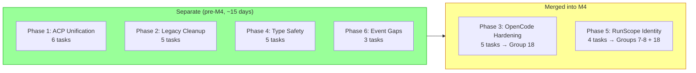

**Advantages**

- Orthogonal cleanup (Phases 1/2/4/6) is isolated and independently verifiable
- ACP path unification (highest risk) is debugged before M4 complexity is added
- OpenCode route files are changed only once (during M4), not twice
- RunScope abstraction is introduced alongside M4's routing implementation, not as a separate empty shell
- Shorter pre-M4 timeline (~15 days vs 30) with no loss of M4 readiness
- Type safety improvements make M4 code type-safe from the start

**Disadvantages**

- M4 carries additional cleanup tasks (9 tasks) alongside new feature work
- OpenCode hardening verification is interleaved with M4 verification
- Phase 3 and 5 task tracking spans two OpenSpec changes

**Evaluation Against Criteria**

| Criterion | Rating | Notes |
|-----------|--------|-------|
| M4 Readiness | ★★★★★ | All items resolved; overlapping items resolved within M4 |
| Type Safety | ★★★★★ | Phases 1/2/4 address all type:ignore and duck-typing |
| Architectural Cleanliness | ★★★★★ | Single execution path; no encapsulation violations |
| Implementation Speed | ★★★★☆ | ~15 days separate + 9 tasks folded into M4 (no extra time) |
| Risk of Regression | ★★★★☆ | Smaller separate changeset; ACP risk isolated |
| Merge Conflict Risk | ★★★★☆ | Shorter separate PR; M4 changes are additive |

**Effort Estimate**

- Complexity: Medium-High
- Resources: 1 developer, ~15 task-days (separate) + 9 tasks merged into M4
- Dependencies: Phase 1 must complete before M4 starts

**Risk Assessment**

| Risk | Likelihood | Impact | Mitigation |
|------|------------|--------|------------|
| M4 task group 18 adds scope creep | Medium | Low | Tasks are well-scoped from explore agent findings |
| OpenCode hardening bugs are harder to isolate in M4 | Low | Medium | Verification gates V6/V9 applied within M4 |

---

### Options Comparison Summary

| Criterion | Option 1: Full | Option 2: Core | Option 3: ACP Only | Option 4: Hybrid |
|-----------|----------------|----------------|---------------------|------------------|
| M4 Readiness | ★★★★★ | ★★★☆☆ | ★★☆☆☆ | ★★★★★ |
| Type Safety | ★★★★★ | ★★★★★ | ★★☆☆☆ | ★★★★★ |
| Architectural Cleanliness | ★★★★★ | ★★★★☆ | ★★☆☆☆ | ★★★★★ |
| Implementation Speed | ★★★☆☆ | ★★★★☆ | ★★★★★ | ★★★★☆ |
| Risk of Regression | ★★★☆☆ | ★★★★☆ | ★★★★★ | ★★★★☆ |
| Merge Conflict Risk | ★★☆☆☆ | ★★★☆☆ | ★★★★★ | ★★★★☆ |
| **Overall** | **28/30** | **25/30** | **21/30** | **29/30** |

---

## Recommendation

### Recommended Option

**Option 4: Hybrid — Orthogonal Phases Separately, Overlapping Phases with M4**

### Justification

Option 4 scores highest (29/30) by achieving the same M4 Readiness and Type Safety as Option 1 (full cleanup) while reducing the separate pre-M4 timeline from ~30 to ~15 days. The key insight is that Phases 3 (OpenCode hardening) and 5 (RunScope identity) touch the same OpenCode route files that M4 modifies — doing them separately means two rounds of changes to the same files, with merge conflict risk in between.

On Merge Conflict Risk (weighted Low), Option 4 scores ★★★★☆ vs Option 1's ★★☆☆☆. The separate cleanup is scoped to ACP server, orchestrator, and lifecycle files — none of which M4 modifies. The OpenCode route changes happen once, during M4.

On Risk of Regression (weighted Medium), Option 4 scores ★★★★☆ vs Option 1's ★★★☆☆. The separate changeset is smaller (19 tasks vs 43), and the highest-risk item (ACP path unification) is isolated and tested before M4's multi-config complexity is introduced.

### Accepted Trade-offs

1. **M4 carries 9 additional cleanup tasks (task group 18)**: Acceptable because these tasks are well-scoped from explore agent findings and touch files M4 modifies anyway.
2. **Phase 3 and 5 tracking spans two OpenSpec changes**: Acceptable because the `pre-m4-protocol-cleanup` tasks.md explicitly cross-references the moved tasks, and `m4-multi-config` task group 18 references the origin.
3. **ACP path unification (Phase 1) must complete before M4 starts**: Acceptable because Phase 1 is the highest-risk item and benefits from isolated debugging.
4. **`ACPTurn.execute()` becoming live may surface latent bugs**: Acceptable because snapshot tests provide before/after comparison, and each task is an incremental commit.

### Conditions

- Phase 1 (ACP unification) must complete and pass snapshot tests before M4 begins
- Phases 2, 4, 6 can proceed in parallel after Phase 1
- M4 task group 18 (OpenCode hardening + identity) should be executed early in M4, before RunScope routing implementation (task groups 8-9)
- Phase 7 (nice-to-have) is explicitly optional and does not block M4

---

## Technical Design

### Architecture Overview

#### Current State (Post-M3)

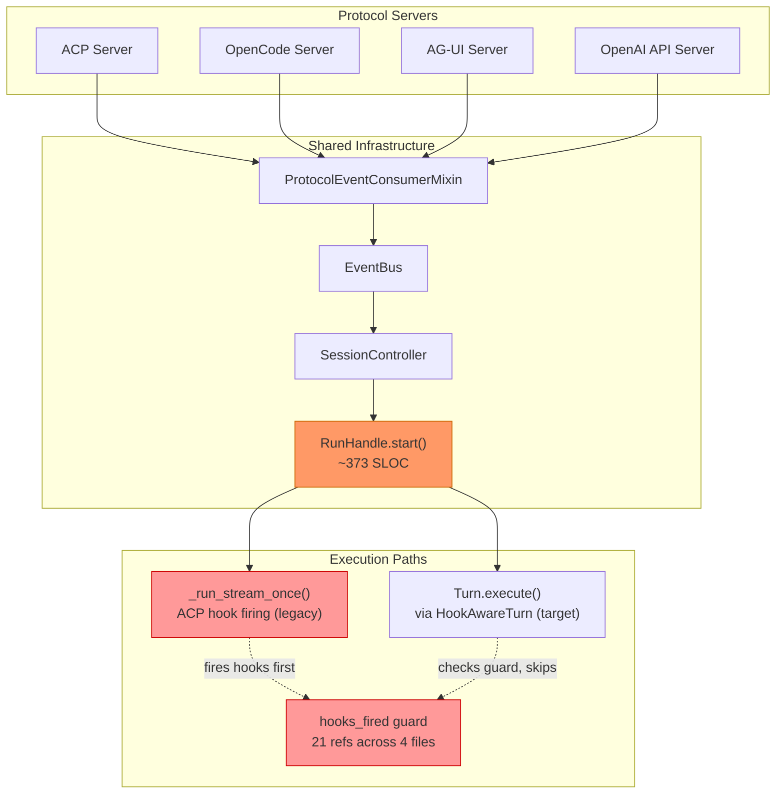

#### Target State (Post-Cleanup)

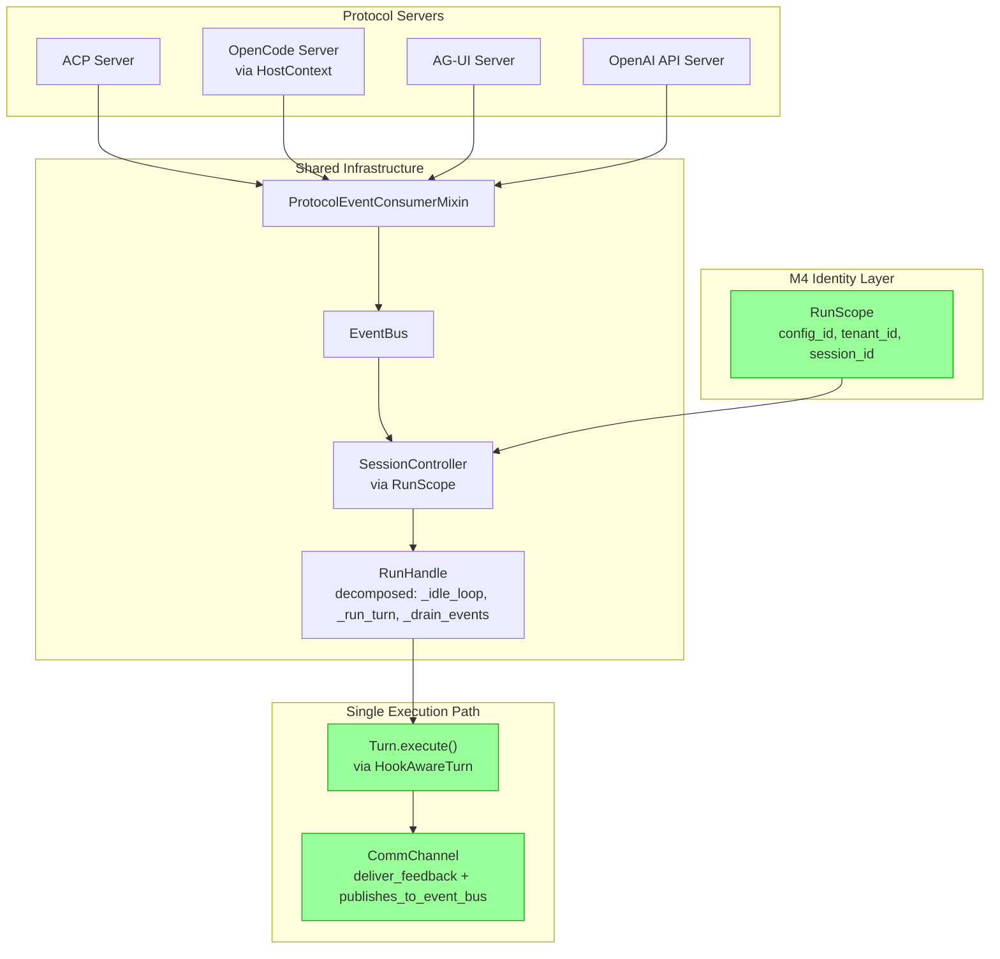

### Phase 1: ACP Execution Path Unification

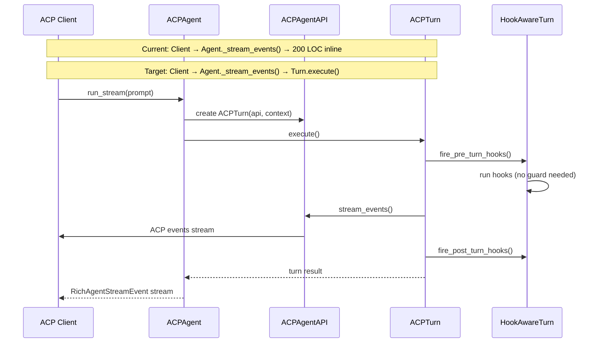

**Key changes:**
- `ACPAgentAPI` gains `stream_events()` and `get_messages()` (wrapping `ACPClient`)
- `ACPAgent._stream_events()` delegates to `ACPTurn.execute()` instead of inline implementation
- `AGENT_TYPE != "native"` hook firing branches deleted from `base_agent.py`
- `hooks_fired` set removed from `AgentRunContext`; all 21 references deleted

### Phase 2: CommChannel Protocol Typing

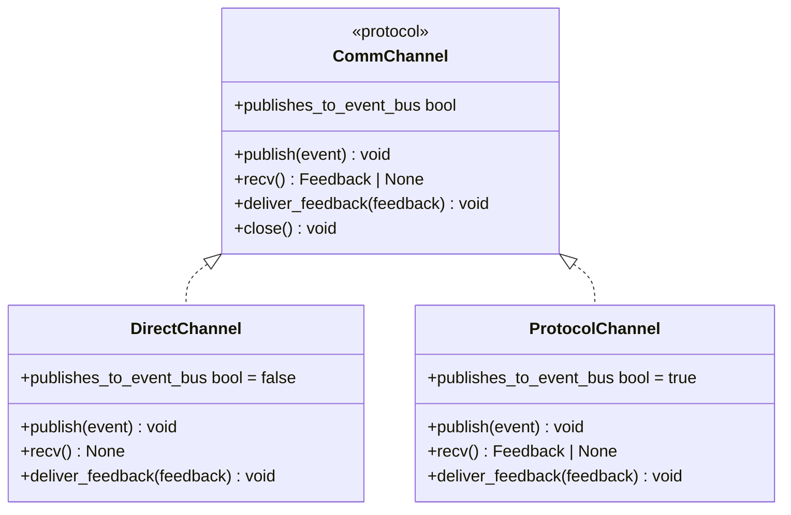

**Key changes:**
- `deliver_feedback(feedback: Feedback) -> None` added to `CommChannel` protocol
- `DirectChannel.deliver_feedback` = no-op; `ProtocolChannel.deliver_feedback` = enqueue to feedback queue
- `publishes_to_event_bus: bool` property replaces `isinstance(channel, ProtocolChannel)` check
- `RunHandle` holds direct `_journal` reference instead of accessing `self._comm_channel._journal`
- 8 `# type: ignore[attr-defined]` in `run.py` eliminated

### Phase 3: OpenCode Server — Private Access & state.pool Migration

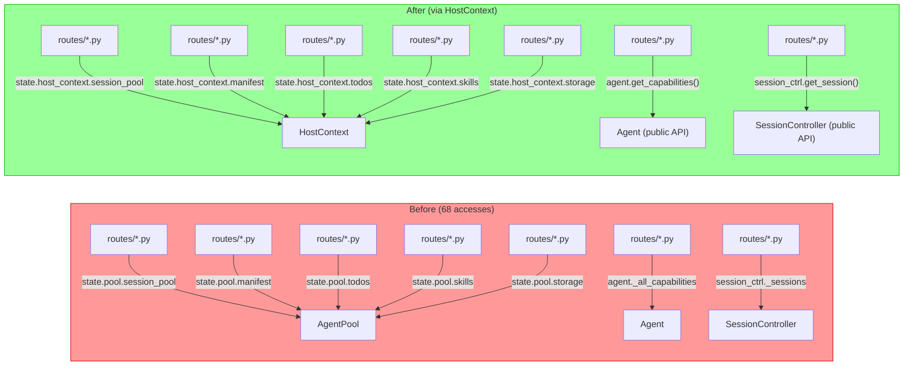

**New public API methods:**

| Method | Replaces |
|--------|----------|
| `Agent.get_capabilities() -> list[AbstractCapability]` | `agent._all_capabilities` |
| `Agent.get_all_tools() -> list[Tool]` | `agent._get_all_tools()` |
| `SessionController.get_session(id) -> SessionState \| None` | `session_controller._sessions[id]` |
| `LspManager.get_server(name) -> LspServer \| None` | `lsp_manager._servers[name]` |
| `SessionPool.get_runs(session_id) -> dict` | `session_pool.sessions._runs` |

### Phase 4: RunHandle.start() Decomposition

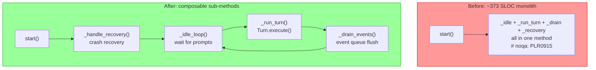

### Phase 5: RunScope Identity Abstraction

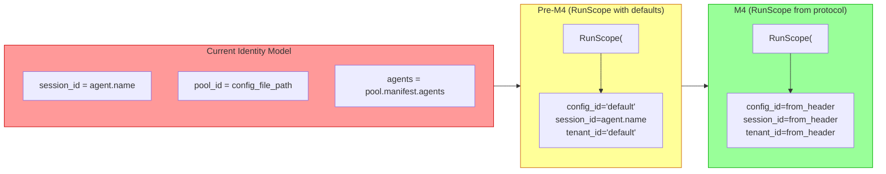

```python
@dataclass(frozen=True)
class RunScope:
    config_id: str = "default"
    tenant_id: str = "default"
    session_id: str | None = None  # defaults to agent.name pre-M4
    user_id: str | None = None
```

---

## Implementation Plan

### Phases

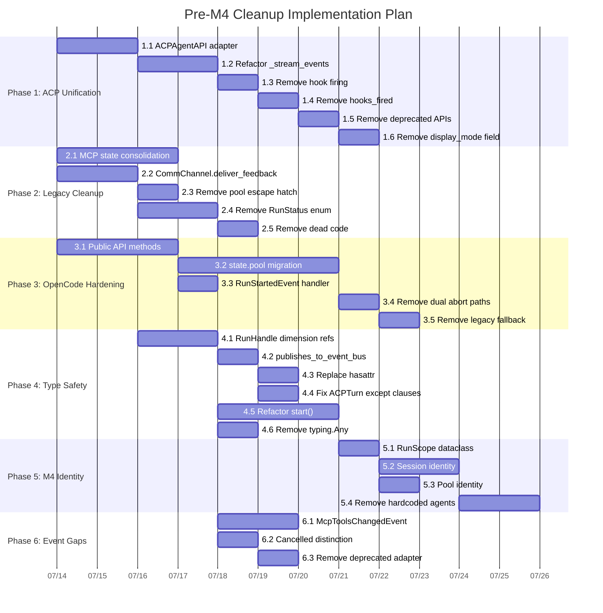

### Phase Dependencies

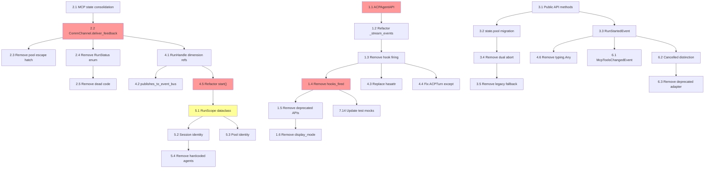

### Milestones

| Milestone | Description | Target | Status |
|-----------|-------------|--------|--------|
| M-1 | Phase 1 complete: ACP unified, snapshot test green | Day 8 | Not Started |
| M-2 | Phases 2-4 complete: Type safety gates pass | Day 18 | Not Started |
| M-3 | Phase 5 complete: RunScope abstraction in place | Day 24 | Not Started |
| M-4 | Phase 6 complete: All verification gates green | Day 28 | Not Started |
| M-5 | M4 can begin | Day 30 | Not Started |

### Rollback Strategy

Each phase is a set of incremental commits. If a phase introduces regressions:

1. Revert the phase's commits via `git revert`
2. The phases are designed to be independent (except Phase 5 depends on 1–4)
3. Phase 1 can be reverted independently if ACP path unification surfaces critical bugs
4. `hooks_fired` guard can be restored if double-firing is detected after removal

---

## Open Questions

1. **`_agent_pool` constructor threading**
   - Context: 25+ refs thread `_agent_pool` through constructors for internal wiring. Removing this requires changing constructor signatures across `MessageNode` and 3 agent files.
   - Question: Should this be done now or deferred to the AgentWolf rename (where constructor signatures change anyway)?
   - Owner: Leoyzen
   - Status: Open — lean toward deferring to rename

2. **`session_pool_integration.py` file split**
   - Context: 1,453 LOC in one file with 4 responsibilities (event consumer, event adapter, session lifecycle, tool registration). Splitting is mechanical but touches many imports.
   - Question: Worth doing before M4 or during M4 when the file is already being modified for RunScope?
   - Owner: Leoyzen
   - Status: Open — lean toward during M4

3. **`RunScope` placement**
   - Context: `RunScope` needs to be consumed by both `RunHandle` (orchestrator layer) and protocol servers (server layer). RFC-0050 places it in the protocol layer.
   - Question: Should `RunScope` live in `orchestrator/` (runtime concern) or `lifecycle/` (infrastructure concern)?
   - Owner: Leoyzen
   - Status: Open — lean toward `orchestrator/` since it's a runtime routing concept

---

## Decision Record

> Complete this section after RFC review is concluded.

### Decision

**Status**: Pending Review

**Date**: TBD

**Approvers**:
- Leoyzen

### Decision Summary

TBD

### Key Discussion Points

TBD

### Conditions of Approval

TBD

### Dissenting Opinions

TBD

---

## References

### Related Documents

- [OpenSpec Change: pre-m4-protocol-cleanup](../../openspec/changes/archive/proposal.md)
- [Design Document](../../openspec/changes/archive/design.md)
- [Task Breakdown](../../openspec/changes/archive/tasks.md)
- [RFC-0050: AgentWolf v1 Foundation Architecture](./RFC-0050-agentwolf-v1-foundation-architecture.md)
- [RFC-0042: Unified Lifecycle Architecture](./RFC-0042-unified-lifecycle-architecture.md)
- [RFC-0041: Loop/Run Separation](./RFC-0041-loop-run-separation.md)

### External Resources

- [PR #144: refactor/agentwolf v1](https://github.com/Leoyzen/agentpool/pull/144)

### Appendix

#### Debt Item Inventory (51 items)

| ID | Category | Severity | File | Description |
|----|----------|----------|------|-------------|
| B1 | ACP | Blocking | `acp_agent.py:632-662` | `ACPAgentAPI` missing `stream_events()`, `get_messages()` |
| B2 | ACP | Blocking | `base_agent.py:1504-1669` | Dual execution paths |
| B3 | ACP | Blocking | 4 files, 21 refs | `hooks_fired` double-fire guard |
| B4 | ACP | Blocking | `agent.py:337-338` | `_mcp_snapshot`, `_session_connection_pool` legacy fields |
| B5 | ACP | Blocking | `run.py:822-878` | `deliver_feedback` duck-typed, 4 `type: ignore` |
| B6 | ACP | Blocking | `event_converter.py:166-168` | Deprecated `subagent_display_mode` field |
| S1 | OpenCode | Severe | 6 route files | Private attribute access |
| S2 | OpenCode | Severe | OpenCode routes | 68 `state.pool.*` bypassing HostContext |
| S3 | OpenCode | Severe | `event_processor.py` | `RunStartedEvent` not handled |
| S4 | OpenCode | Severe | `session_routes.py:914-947` | Dual abort paths |
| S5 | OpenCode | Severe | `session_routes.py:660-665` | Legacy `list_sessions()` fallback |
| S6 | OpenCode | Severe | 5 files | Hardcoded `state.agent.name` as identity |
| S7 | OpenCode | Severe | 3 files | `config_file_path` as pool_id |
| S8 | OpenCode | Severe | `agent_routes.py`, `pty_routes.py` | Direct `state.agent.env` access |
| 1.1 | Shared | Moderate | `base_agent.py:1589-1670` | Hook firing dual path |
| 1.2 | Shared | Moderate | `run.py:286-303` | Dual event publishing |
| 1.3 | Shared | Moderate | `turn.py:96-301` | `hooks_fired` guard as migration artifact |
| 1.4 | Shared | Moderate | `session_controller.py:846-891` | `_consume_run` consumer dance |
| 2.1 | Shared | Moderate | `base_team.py:411` | `HostContext.pool` escape hatch (1 remaining) |
| 2.2 | Shared | Moderate | `run.py:130-998` | Legacy `RunStatus` enum coexists with `RunState` |
| 3.1 | Shared | Moderate | `session_controller.py:484-491` | Dead code after return |
| 3.2 | Shared | Moderate | `session_controller.py:436-964` | Single-config hardcoding |
| 3.3 | Shared | Moderate | `acp_agent/turn.py:180-240` | Generic `except Exception` clauses |
| 3.4 | Shared | Moderate | `run.py:401-779` | `RunHandle.start()` ~373 SLOC |
| 4.1 | Shared | Moderate | `run.py:286-303` | `_channel_publishes_to_event_bus` fragile isinstance |
| 4.2 | Shared | Moderate | `run.py` 8 sites | `# type: ignore[attr-defined]` cluster |
| 4.3 | Shared | Moderate | `session_controller.py:964` | `# type: ignore[arg-type]` |
| 4.4 | Shared | Moderate | `base.py:56` | `BaseServer.pool` weakly typed |
| M1-M6 | OpenCode | Moderate | Various | Duplicated logic, file size, unwired events |
| N1-N12 | ACP | Nice-to-have | Various | TODOs, deprecated code, `hasattr`/`getattr` patterns |
| N1-N5 | OpenCode | Nice-to-have | Various | Deprecated test artifacts, TODOs, typing |
